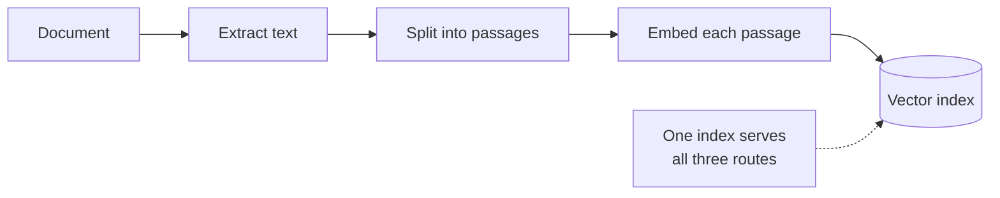
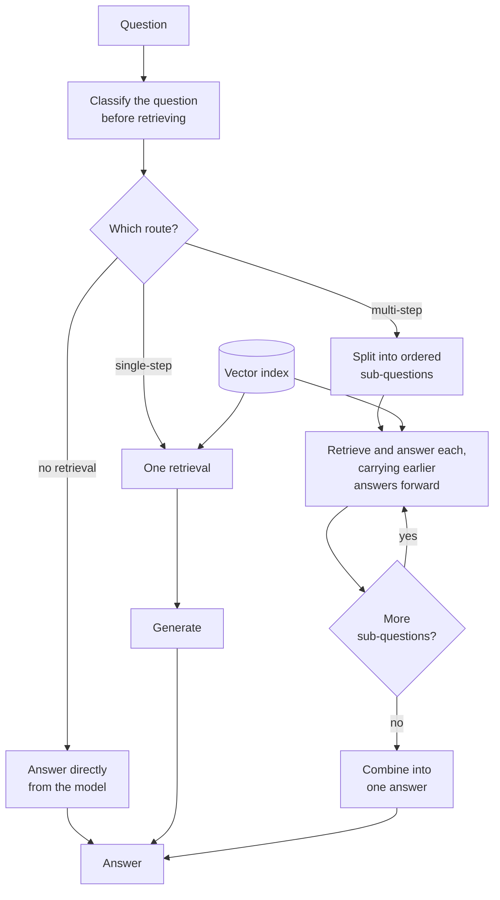

# Adaptive RAG

## What it is

Adaptive RAG classifies each question before doing anything, then sends it down a pipeline sized for it. Small talk gets no retrieval, a simple factual question gets one search, and a complex question is split into sub-questions that are each searched in turn. Easy questions stay cheap, and hard ones get the extra work they need.

## Ingestion flow

## Retrieval and generation flow

## Strengths

- **Cost matches difficulty.** Only hard questions pay for decomposition.
- **One cheap call up front.** A single classification avoids wasted searches and under-served hard questions.
- **Hard questions become answerable.** Multi-part questions get several lookups instead of one.
- **Routes are independent.** Each path can be tuned or replaced, and new ones (SQL, graph, web) slot in as extra branches.

## Limitations

- **The router guesses blind.** It sees only the question, before any evidence, and nothing downstream revisits its choice.
- **"No retrieval" is the riskiest route.** A wrong call gives an answer from the model's memory that looks just like a grounded one.
- **Misrouted hard questions fail quietly.** One search gives a plausible half-answer with no warning.
- **The multi-step plan is fixed.** It can't add a step it didn't plan for, and errors in early sub-answers carry forward.
- **Route boundaries are fuzzy.** Many questions sit between single- and multi-step.

## Where to use it

- Assistants whose questions vary a lot in shape and difficulty.
- High-volume systems where savings on easy questions add up.
- One input box that handles both chat and document search.
- Not when every question has the same shape; the router is then pure overhead.

## In this demo

- A LangGraph `StateGraph`. Collection: `rag_adaptive`.
- `route` makes one structured-output call that labels the question `no_retrieval`, `single_step` or `multi_step`, with a one-sentence reason.
- `no_retrieval` → `no_retrieval_generate`, which never touches the document.
- `single_step` → `single_retrieve` (one `$vectorSearch`) → `single_generate`.
- `multi_step` → `decompose` into 2–3 ordered sub-questions → `hop` loop (retrieve and answer each, feeding earlier sub-answers into later prompts) → `combine`.
- The page shows the route and its reason, the sub-question/sub-answer trail on the multi-step path, and the graph with this question's path outlined.
- Compare with Multi-hop RAG, which always decomposes. There the hop loop is the subject; here the routing decision is.
