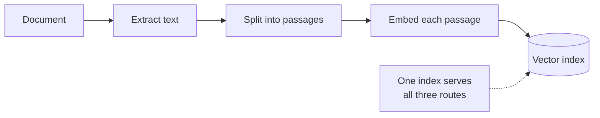
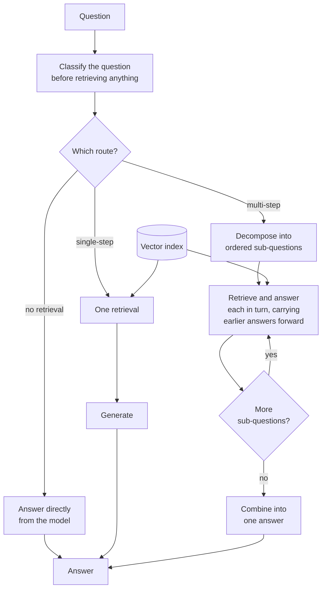

# Adaptive RAG

## What it is

Questions are not all the same size, but a fixed pipeline treats them as if they were.

"Hello" gets a vector search. "What is the refund window?" gets the same vector search. "How does the refund window in the consumer policy compare with the business one, and which changed most recently?" also gets the same vector search — one pass, top-k passages — even though answering it properly requires three separate lookups and a comparison. The first question wastes a retrieval; the third is under-served by one.

Adaptive RAG puts a **classifier at the front** and routes each question to a pipeline sized for it. A typical set of routes:

- **No retrieval** — greetings, small talk, and general knowledge the document has no bearing on. Answer directly; touching the corpus adds nothing but noise and latency.
- **Single-step** — a factual question one retrieval can answer. The ordinary pipeline, which is the right answer most of the time.
- **Multi-step** — a question needing several connected lookups. Break it into ordered sub-questions, answer each with its own retrieval, feed earlier answers into later ones, then compose a final answer from the chain.

The idea is that **the cost of answering should match the difficulty of the question.** Most questions are easy and should stay cheap; the expensive machinery should be reserved for the ones that need it. A pipeline built for the hardest question overpays on every easy one, and a pipeline built for the easiest fails the hard ones silently.

Everything then rests on one call. The router sees only the question — not the corpus, not any retrieved passage — and commits the run to a path before any evidence exists. That makes it the cheapest possible decision and also an unrecoverable one: nothing downstream re-examines it. This is the deliberate contrast with CRAG and Self-RAG, which spend more to decide *after* seeing evidence and can change course. Adaptive RAG bets that a good enough guess up front is worth more than the ability to correct.

## Ingestion flow

## Retrieval and generation flow

## Strengths

- **Cost tracks difficulty.** Easy questions stay at one call; only genuinely hard ones pay for decomposition.
- **One cheap decision buys a lot.** A single classification call up front avoids both wasted retrievals and under-served hard questions.
- **Hard questions get a pipeline that can actually answer them**, instead of a single pass that structurally cannot.
- **Routes are independently improvable.** Each path can be tuned, swapped or extended without touching the others.
- **It degrades sensibly under pressure.** A misrouted hard question still gets a reasonable single-step answer rather than nothing.
- **Extensible by construction** — a SQL route, a graph route or a web route slots in as another branch.

## Limitations

- **The router decides blind and is never second-guessed.** Classification happens before any evidence exists, and no downstream step revisits it.
- **The no-retrieval route is the riskiest.** If the router is wrong, the answer comes from the model's own knowledge with nothing marking it as unverified — no citation, no warning, no visible difference from a grounded answer.
- **Misrouting a multi-step question is a quiet failure.** It gets one retrieval, produces a plausible partial answer, and nothing flags that half the question went unaddressed.
- **The multi-step path is the most expensive thing here** — a decompose call, a retrieval and a generation per sub-question, and a combine call.
- **Decomposition is planned once, up front.** A sub-answer that reveals a needed extra hop cannot add one; the chain runs exactly as planned.
- **Errors propagate down the chain.** Each later sub-question treats earlier sub-answers as fact, and nothing verifies across hops.
- **Route boundaries are fuzzy.** Plenty of real questions sit genuinely between single- and multi-step, and the classifier's label is more confident than the underlying distinction.

## Where to use it

- Mixed-traffic assistants where questions genuinely vary in shape and a fixed pipeline is wrong for most of the distribution.
- High-volume systems where the saving on easy questions dominates the total bill.
- Products combining conversational chat with document search in one input box.
- Systems with several retrieval backends, where routing chooses the source as well as the depth.
- Not where every question is the same shape — the router is then pure overhead — and not where a wrong route is unacceptable, since there is no recovery path.

## In this demo

A LangGraph `StateGraph` whose `route` node makes one structured-output call classifying the question as `no_retrieval`, `single_step` or `multi_step`, with a one-sentence reason. `no_retrieval` goes to `no_retrieval_generate`, which never touches the document. `single_step` runs `single_retrieve` (one `$vectorSearch` against `rag_adaptive`) then `single_generate`. `multi_step` runs `decompose` into 2–3 ordered sub-questions, then loops `hop` — retrieve and answer each sub-question, folding earlier sub-answers into later prompts — before `combine` merges them. The page shows the chosen route and its reason, the sub-question/sub-answer trail on the multi-step path, and the graph with this question's path outlined.

Compare with Multi-hop RAG, which always decomposes: there the hop mechanism is the subject, here it is one of three branches and the routing decision is the subject.
