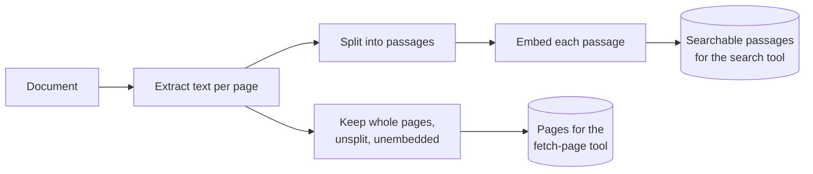
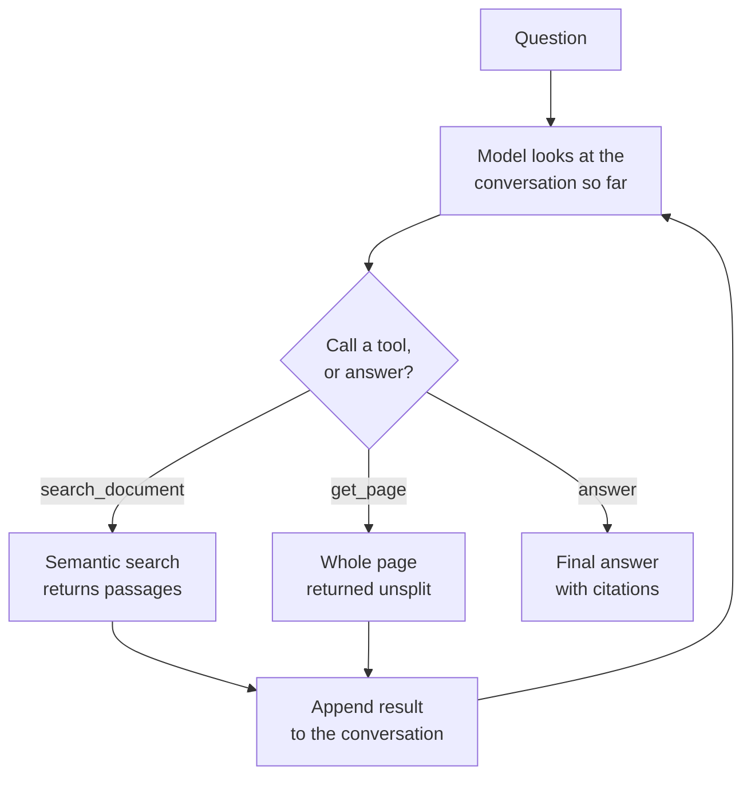

# Agentic RAG

## What it is

Every pipeline so far decides in advance how retrieval will happen: one search, of one kind, at one moment, whatever the question. Agentic RAG removes that decision from the pipeline and gives it to the model.

Retrieval stops being a stage and becomes a **tool** — a function the model may call, with arguments it chooses. The model is told what tools exist and what they are for, then runs a loop: look at the conversation so far, either call a tool or write the final answer; if a tool was called, append its result and look again. The loop ends when the model stops calling tools.

What this buys is that the *shape* of retrieval adapts to the question. A greeting gets answered with no search at all. A question phrased differently from the document gets searched twice, with the model rewriting its own query after a weak first result. A question about a table gets a targeted search followed by a request for the whole page, because the passage alone was cut off mid-row. A multi-part question gets one search per part. None of these paths were programmed; they emerge from the model's choices inside the loop.

The tools are where the design work lives. Giving the model a semantic search plus a way to fetch a whole page by number is already enough for genuinely different strategies, because the two tools fail in different ways and the model can fall back from one to the other.

The corresponding cost is that you no longer know what a question will cost or how long it will take. A fixed pipeline makes exactly one model call; this one makes somewhere between one and the recursion limit, decided at runtime. That is why the trace matters as much as the answer here: it is the only place the strategy is visible.

## Ingestion flow

## Retrieval and generation flow

## Strengths

- **The strategy fits the question.** One search, five searches, or none — decided per question instead of fixed at build time.
- **It can recover from a bad retrieval.** A fixed pipeline gets one attempt; an agent that sees a useless result can rephrase and search again, which is the single most valuable behaviour here.
- **Multi-part questions work in one turn**, because nothing limits the loop to a single retrieval.
- **No retrieval on questions that don't need it.** Small talk and follow-ups already answered in the conversation cost nothing extra.
- **Tools compose.** A hybrid retriever, a re-ranker, a database query or a web search can each be added as another tool without redesigning the pipeline.
- **The trace is a genuine explanation.** Every query the model chose and every result it saw is recorded, so "why did it answer that" is answerable.

## Limitations

- **Cost and latency are unpredictable.** The same page can answer one question in a second and another in fifteen. Only a recursion limit bounds the worst case.
- **It is the most model-dependent technique here.** Tool-calling ability varies enormously; a small local model will search with poor queries, skip a search it needed, or fabricate an answer it should have looked up.
- **Loops are a real failure mode.** A model can repeat a search that keeps returning nothing, burning turns until the recursion limit stops it.
- **Skipping retrieval is a silent error.** When the model answers from its own parameters instead of the document, the answer arrives with no citation and no warning — it looks like any other answer.
- **Most calls per question of anything in this app**, since every tool call is a full round-trip.
- **The system prompt is load-bearing and fragile.** Guidance about when not to search has to be unambiguous, and ambiguity shows up as erratic behaviour rather than an error.
- **Harder to evaluate.** With a non-deterministic path, a regression can be a change in tool-calling behaviour rather than in any single component.

## Where to use it

- Document assistants where questions vary in shape and no single retrieval strategy covers them.
- Corpora needing more than one access pattern — search, plus fetch by page, section, table or identifier.
- Conversational interfaces, where follow-ups depend on what was already retrieved earlier in the thread.
- Debugging and exploration, where seeing the retrieval strategy is as valuable as the answer.
- Situations where you have a capable model available; with a weak one, a fixed pipeline is usually both cheaper and better.

## In this demo

Built with LangChain's `create_agent` (a LangGraph ReAct loop underneath) over two tools: `search_document(query)` runs `$vectorSearch` against `rag_agentic` and returns top passages with page numbers, and `get_page(page)` returns one whole page unchunked, for when a passage is cut off mid-table or mid-list. Ingest stores both kinds of record — embedded passages and whole page texts with no embedding — keyed by `doc_id` and cleared together. The system prompt tells the model what each tool is for and to answer greetings directly without searching. `agentic_recursion_limit` in `core/config.py` bounds the loop; hitting it raises rather than answering. Every tool call is recorded in order with its arguments and a summary of what came back, and shown in the trace.

Worth trying against a small local model (`qwen2.5:7b-instruct` via Ollama) as well as a frontier one — the difference in tool-calling discipline is the clearest demonstration of this technique's model dependence.
