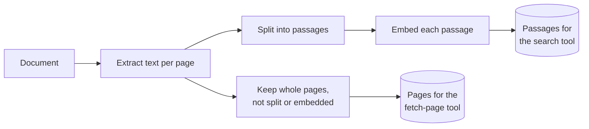
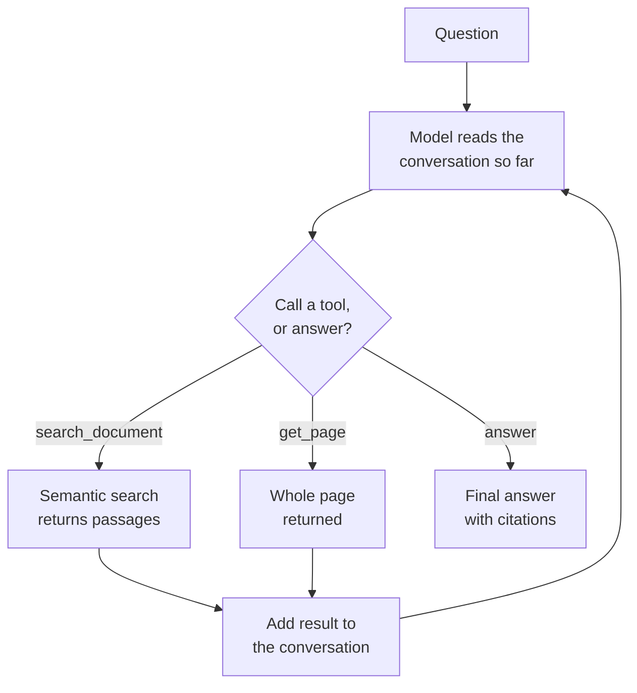

# Agentic RAG

## What it is

In Agentic RAG, retrieval is a **tool** the model can call, not a fixed step. The model runs in a loop: read the conversation, then either call a tool (such as "search the document") or write the answer. This lets it search several times, rephrase a weak query, or skip searching entirely, depending on the question.

## Ingestion flow

## Retrieval and generation flow

## Strengths

- **Strategy fits the question.** No search, one search, or several, decided per question.
- **Recovers from bad retrieval.** After a useless result the model can rephrase and search again.
- **Handles multi-part questions** in one turn, with one search per part.
- **Tools compose.** A re-ranker, database query or web search can be added as another tool.
- **The trace explains the answer.** Every query and result the model saw is recorded.

## Limitations

- **Unpredictable cost and latency.** Only a step limit bounds the worst case.
- **Depends heavily on the model.** Weak tool-callers write poor queries, skip needed searches, or make things up.
- **Can loop.** The model may repeat a failing search until the step limit stops it.
- **Skipping retrieval is silent.** An answer from the model's memory looks like any other.
- **Hard to evaluate.** The path changes run to run, and behaviour hinges on a fragile system prompt.

## Where to use it

- Document assistants where questions vary and no single retrieval strategy fits.
- Data that needs more than one access pattern (search plus fetch by page, table or ID).
- Multi-turn chat where follow-ups build on earlier retrieval.
- Only with a capable model; with a weak one a fixed pipeline is cheaper and better.

## In this demo

- Built with LangChain's `create_agent` (a LangGraph ReAct loop). Collection: `rag_agentic`.
- Two tools:
  - `search_document(query)` runs `$vectorSearch` and returns top passages with page numbers.
  - `get_page(page)` returns one whole unsplit page, for passages cut off mid-table or mid-list.
- Ingest stores both embedded passages and whole page texts (no embedding), keyed by `doc_id` and cleared together.
- The system prompt describes each tool and says to answer greetings without searching.
- `agentic_recursion_limit` in `core/config.py` bounds the loop; hitting it raises an error instead of answering.
- Every tool call is shown in order in the trace, with its arguments and a summary of the result.
- Try it with a small local model (`qwen2.5:7b-instruct` via Ollama) and a frontier one: the gap in tool-calling discipline shows the model dependence clearly.
