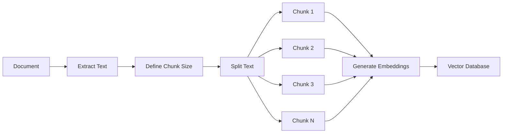
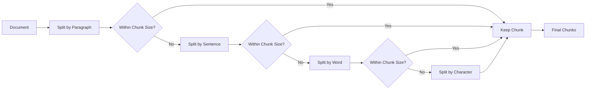
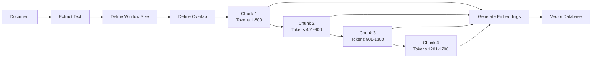
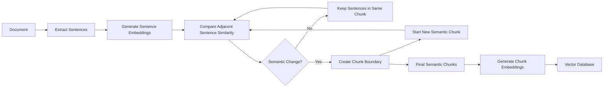
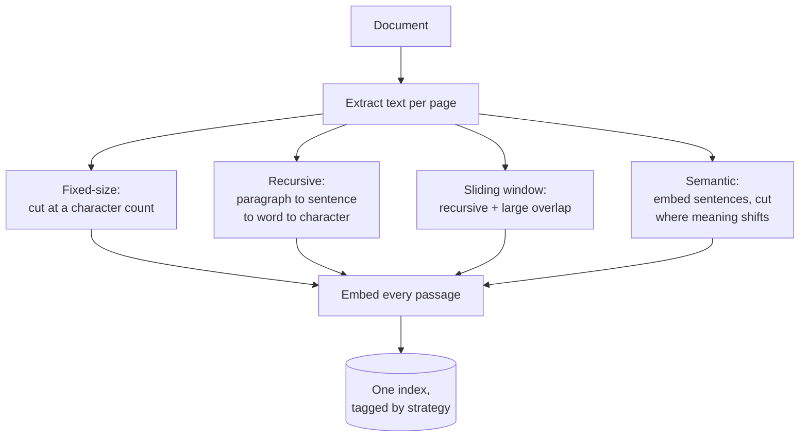
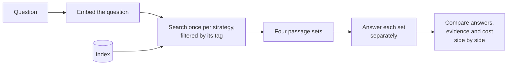

# Chunking strategies

## What it is

Chunking is the decision nobody makes deliberately and everybody lives with: before a document can be retrieved from, it has to be cut into pieces, and where those cuts land determines what can ever be found.

The tension is simple. Cut too small and a passage no longer carries enough context to answer anything — the sentence that names the subject ends up in a different piece from the sentence that states the fact. Cut too large and every passage matches everything vaguely and nothing precisely, and the prompt fills up with text that is mostly irrelevant. Every strategy below is a different answer to "where should the boundary go".

The first three below are structural — they look at the shape of the text. Only the last looks at what the text means, and it pays for that with an embedding pass at ingest time.

### Fixed-size

Cuts at a character count, respecting only a coarse separator like a blank line. It is the cheapest and the most likely to cut mid-idea.

### Recursive

Tries a ladder of separators — paragraph, then sentence, then word, then character — and uses the largest one that keeps the piece under the target size. It respects the document's natural structure where it can and falls back gracefully where it can't.

### Sliding window

Recursive splitting with a large overlap, so consecutive passages share text. A fact cut by one boundary survives whole inside its neighbour. You buy that insurance with storage and redundancy.

### Semantic

Ignores size targets and cuts where the *meaning* changes: embed each sentence, measure how much each neighbouring pair differs, and start a new passage wherever the drop is unusually large. Boundaries land on topic shifts rather than on character counts.

## Ingestion flow

## Retrieval and generation flow

## Strengths

- **It isolates one variable.** Same document, same embedding model, same retrieval, same question — only the boundaries move, so any difference in the answers is attributable to the split.
- **Recursive splitting is a strong default.** It respects structure, stays near a predictable size, and costs nothing extra at ingest.
- **Overlap is a cheap fix for a common failure.** If facts keep getting cut in half, widening the window fixes it without any new machinery.
- **Semantic boundaries match how documents are actually organised** — by topic, not by length — and pay off most on long, topically varied pages.

## Limitations

- **Fixed-size cuts through meaning by design.** It cannot see a sentence or a table, only a length, and an oversized piece is left oversized rather than re-split.
- **Overlap multiplies the corpus.** A large sliding window can double or triple the passage count, and with it the embedding cost, the storage and the redundancy in every retrieved set.
- **Semantic chunking costs an embedding pass per sentence** at ingest, and produces unpredictable sizes — a very short passage can sit next to a very long one when topics shift sharply.
- **Sentence detection is harder than it looks.** Splitting on punctuation mis-fires on abbreviations, decimals and citations, and every semantic splitter inherits those mistakes.
- **There is no universally best setting.** The right size depends on the document, the embedding model's context window and the questions being asked, which is why this is a comparison page rather than a recommendation.
- **Boundaries are permanent.** Changing the strategy means re-embedding and re-indexing the whole corpus.

## Where to use it

- Before committing to a strategy for a new document type — run all four once and look at how differently they carve up the same pages.
- When a retrieval pipeline keeps missing an answer you can see in the document: it is often a chunking problem wearing a retrieval problem's clothes.
- Deciding whether semantic chunking's ingest cost is justified, which depends almost entirely on whether the document has real topic structure inside a page.
- Documents with a strong native structure — headed sections, clauses, catalogue entries — where a structural splitter can be pointed at the real boundaries.

## In this demo

All four splitters write into one MongoDB collection (`rag_chunking`) tagged with a `strategy` field and retrieved with `$vectorSearch` filtered on that tag. Fixed-size, recursive and sliding window use `langchain-text-splitters` (`CharacterTextSplitter`, `RecursiveCharacterTextSplitter`); semantic is hand-written, embedding sentences with `bge-small-en-v1.5` and cutting on the similarity drop between neighbours, with sentences found by a plain `(?<=[.!?])\s+` regex. Splitting runs per page so page citations work. One question runs the full pipeline four times — four separate chat-model calls, sequentially — so each column has its own answer, latency and token count; a strategy whose call fails shows as unavailable while the others complete.

`chunk` is used instead of `passage` on this page only, because here the chunk is the subject.
