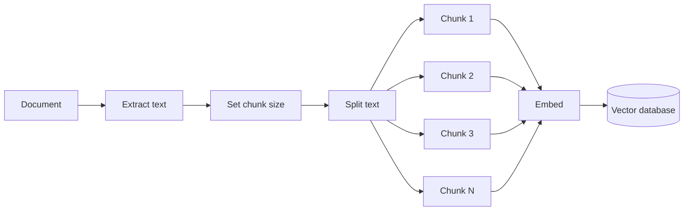
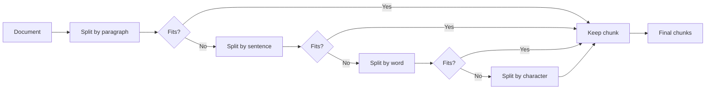
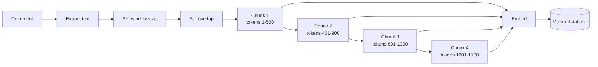
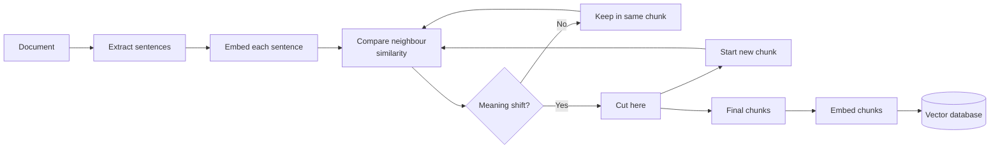
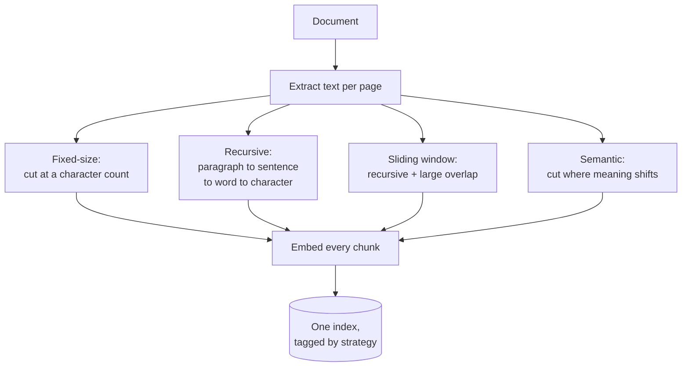
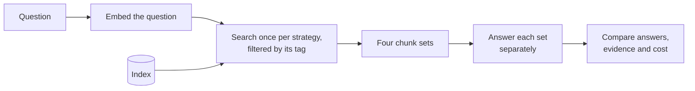

# Chunking strategies

## What it is

Before a document can be searched it has to be cut into pieces (chunks), and where the cuts land decides what can be found. Chunks that are too small lose context; chunks that are too large match everything vaguely and fill the prompt with noise. Each strategy below is a different answer to where the boundary should go.

### Fixed-size

Cuts at a character count. Cheapest, and the most likely to cut mid-idea.

### Recursive

Tries paragraph, then sentence, then word, then character breaks, using the largest that keeps the chunk under the target size.

### Sliding window

Recursive splitting with a large overlap, so a fact cut by one boundary survives whole in the next chunk.

### Semantic

Embeds each sentence and starts a new chunk where neighbouring sentences differ sharply in meaning, so cuts land on topic shifts.

## Ingestion flow

## Retrieval and generation flow

## Strengths

- **Recursive is a strong default.** It follows the text's structure, keeps sizes predictable, and costs nothing extra.
- **Overlap is a cheap fix.** If facts keep getting cut in half, a wider overlap fixes it with no new machinery.
- **Semantic cuts follow topics.** Documents are organised by topic, not length, and this pays off on long, varied pages.
- **Easy to compare.** Only the boundaries change, so differences in answers come from the split alone.

## Limitations

- **Fixed-size ignores meaning.** It sees only length, so it cuts through sentences and tables.
- **Overlap inflates the corpus.** More chunks means more embedding cost, storage and duplicate text in results.
- **Semantic is costly and uneven.** It embeds every sentence at ingest and gives unpredictable chunk sizes.
- **No universal best setting.** The right choice depends on the document, the embedding model and the questions.
- **Boundaries are permanent.** Changing strategy means re-embedding and re-indexing everything.

## Where to use it

- Choosing a strategy for a new document type.
- When retrieval misses an answer you can see in the document; it is often a chunking problem.
- Deciding whether semantic chunking's ingest cost is worth it.
- Documents with clear structure (sections, clauses, entries) a splitter can follow.

## In this demo

- One MongoDB collection, `rag_chunking`, with a `strategy` field; retrieval is `$vectorSearch` filtered on it.
- Fixed-size, recursive and sliding window use `langchain-text-splitters` (`CharacterTextSplitter`, `RecursiveCharacterTextSplitter`). Fixed-size splits only on a coarse separator (blank line), so an oversized piece stays oversized.
- Semantic is hand-written: sentences found by a plain `(?<=[.!?])\s+` regex (which mis-fires on abbreviations and decimals), embedded with `bge-small-en-v1.5`, cut on the similarity drop between neighbours.
- Splitting runs per page so page citations work.
- Each question runs the full pipeline four times: four sequential chat-model calls, each column with its own answer, latency and tokens. A strategy whose call fails shows as unavailable; the others still complete.
- This page says "chunk" instead of "passage", because here the chunk is the subject.
