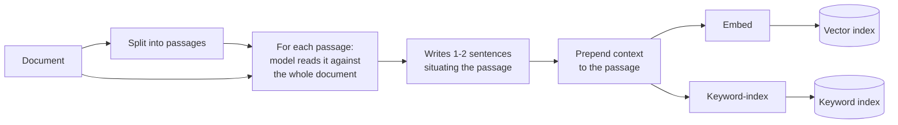
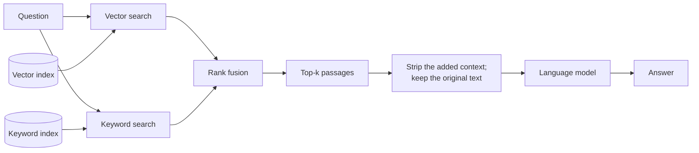

# Contextual retrieval

## What it is

Splitting a document destroys information that was never written down in the passage itself.

Consider a passage that reads, in full: *"Revenue grew 3% over the previous quarter."* A human reading the report knows which company, which quarter and which business segment, because they read the cover page and the section heading on the way down. The passage carries none of that. Once it is cut out and indexed on its own, the embedding encodes only "some revenue grew a bit", and the keyword index holds no company name at all. A question asking about that company's Q2 performance cannot match it — not because retrieval is weak, but because the identifying facts were left behind at the cut.

Contextual retrieval fixes this at ingest time by writing the missing context back in. Before a passage is indexed, a language model reads it alongside the whole document and writes a sentence or two placing it: *"This passage is from ACME Corp's Q2 2023 report, in the section on regional revenue."* That preamble is prepended to the passage, and the combined text is what gets embedded and keyword-indexed.

The effect lands on both halves of a hybrid retriever, which is why the two techniques are usually deployed together. The embedding now encodes the topic the passage left implicit, and the keyword index now holds the proper nouns and dates that a question is likely to quote. A passage that was previously unfindable becomes findable, without changing the retriever at all.

One detail matters for correctness: the added context is used for *retrieval*, but the model answering the question should be shown the original passage. The context is a finding aid, not evidence — it was written by a model and should not be quoted back as though the document said it.

This is a deliberate trade of ingest cost for query quality. Enrichment is paid once per passage; every question afterwards costs exactly what plain retrieval costs.

## Ingestion flow

## Retrieval and generation flow

## Strengths

- **It fixes the cause, not the symptom.** The problem is missing information in the indexed text, and this adds it, rather than working harder to search text that never contained the answer.
- **Queries stay cheap.** All the extra cost is at ingest. Question-time latency and token count are identical to plain hybrid search.
- **It helps semantic and keyword retrieval at once**, which is unusual — most retrieval improvements help one and leave the other alone.
- **It scales with corpus ambiguity.** The more your documents resemble each other, the more it buys, because it is exactly the distinguishing facts that get restored.
- **The retriever is untouched.** No new index type, no new query path, no second model at question time.

## Limitations

- **Ingest cost scales with document length times passage count**, since each enrichment call carries the document for context. This is the dominant cost of the technique and the reason it is usually paired with prompt caching or batched calls.
- **The context is baked in.** Improving the prompt or moving to a better model means re-enriching and re-indexing from scratch.
- **A model writes it, so a model can get it wrong.** A passage mislabelled as belonging to the wrong section is now indexed under that wrong section and will rank for the wrong questions — a confident, silent failure.
- **Generic context is worse than none.** "This passage is part of the document" adds tokens and noise to every passage equally, diluting the index without adding signal.
- **Very long documents do not fit.** Past the model's usable context window the whole document can't be shown, so passages from the unseen parts get weaker context precisely where structure is hardest to infer.
- **It changes every score.** Passages get longer, so keyword length normalisation and the embedding both shift. Usually for the better, but it is a global change, not a targeted one.
- **Self-explanatory documents gain nothing.** If each passage already names its subject, enrichment is pure cost.

## Where to use it

- Collections of near-identical documents — quarterly reports, product sheets, branch policies, contracts on one template — where the distinguishing detail lives in the heading, not the paragraph.
- Long, hierarchical documents where meaning depends on position: manuals, specifications, legal agreements with defined terms introduced far from where they are used.
- Any corpus where you can see the right passage in the document but retrieval consistently fails to surface it.
- Read-heavy systems, where a one-off ingest cost is amortised over many queries.

## In this demo

PyMuPDF text is split per page with `RecursiveCharacterTextSplitter` (~800 chars, 100 overlap). The fast chat model enriches passages in groups of `CONTEXTUAL_CHUNKS_PER_CALL` (default 8) sent as `<passage index="n">` blocks with a structured-output schema returning one `{index, context}` per passage, batched two calls at a time. Each passage is stored twice in `rag_contextual` — `variant=plain` and `variant=contextual` — so the page can ask the same question against both and show how each passage's rank moved; a real system would store only the contextual copy. Retrieval is `MongoDBAtlasHybridSearchRetriever`, which does vector search, BM25 and reciprocal rank fusion in one aggregation (the Hybrid search demo writes that fusion out by hand instead). Both variants put the *original* passage text in the prompt, so any difference in the answers comes from which passages were retrieved.

To stay inside free-tier limits: only the first `CONTEXTUAL_MAX_CHUNKS` (60) passages are enriched and the rest are stored plain; the document is truncated at `CONTEXTUAL_DOC_MAX_CHARS` (60,000); and each context is cached by passage hash under `data/contextual_cache/<doc_id>.json`, so **Re-run enrichment** pays only for passages that have none yet. A rate-limited call leaves its passages plain and counted as failed rather than guessed.
