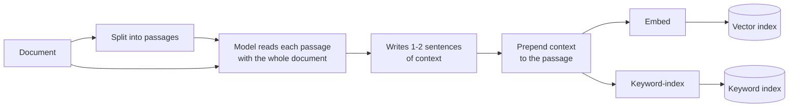

# Contextual retrieval

## What it is

A passage cut out of a document loses what the reader knew from around it: *"Revenue grew 3%"* no longer says which company or which quarter, so a search for those names can't find it. Contextual retrieval fixes this at ingest. A language model reads each passage alongside the whole document and writes a sentence or two placing it ("From ACME's Q2 2023 report, regional revenue section"), and that sentence is added to the passage before it is embedded and keyword-indexed. The answering model still sees only the original passage, because the added context was written by a model and is a search aid, not evidence.

## Ingestion flow

## Retrieval and generation flow

## Strengths

- **Fixes the cause.** It adds the missing names and dates to the indexed text instead of searching harder through text that never had them.
- **Queries stay cheap.** All extra cost is at ingest; question-time cost is the same as plain hybrid search.
- **Helps both search types.** Embeddings and keyword search both gain from the restored details.
- **Retriever unchanged.** No new index type or query path.

## Limitations

- **Expensive ingest.** Every passage needs a model call that carries the document, so it is usually paired with prompt caching or batching.
- **Baked in.** A better prompt or model means re-enriching and re-indexing everything.
- **Can be wrong.** A passage given the wrong context ranks for the wrong questions, silently.
- **Long documents don't fit.** Past the model's context window, passages get weaker context.
- **No gain on self-explanatory text.** If passages already name their subject, it is pure cost.

## Where to use it

- Near-identical documents (quarterly reports, product sheets, template contracts) where the distinguishing detail is in the heading.
- Long, hierarchical documents where meaning depends on position: manuals, specs, legal agreements.
- Corpora where the right passage exists but retrieval keeps missing it.
- Read-heavy systems, where one-off ingest cost is spread over many queries.

## In this demo

- PyMuPDF text, split per page with `RecursiveCharacterTextSplitter` (~800 chars, 100 overlap).
- The fast chat model enriches `CONTEXTUAL_CHUNKS_PER_CALL` (default 8) passages per call, sent as `<passage index="n">` blocks; structured output returns one `{index, context}` per passage. Two calls run at a time.
- Each passage is stored twice in `rag_contextual` (`variant=plain` and `variant=contextual`) so the page can compare ranks for the same question. A real system would store only the contextual copy.
- Retrieval: `MongoDBAtlasHybridSearchRetriever` (vector search + BM25 + reciprocal rank fusion in one aggregation). The Hybrid search demo writes the fusion out by hand.
- Both variants put the *original* passage text in the prompt, so answer differences come only from which passages were retrieved.
- Free-tier caps: only the first `CONTEXTUAL_MAX_CHUNKS` (60) passages are enriched, the rest stored plain; the document is truncated at `CONTEXTUAL_DOC_MAX_CHARS` (60,000).
- Contexts are cached by passage hash in `data/contextual_cache/<doc_id>.json`, so **Re-run enrichment** only pays for passages without one.
- A rate-limited call leaves its passages plain and counted as failed, not guessed.
