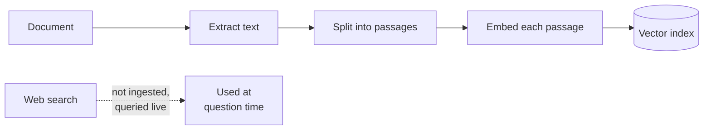
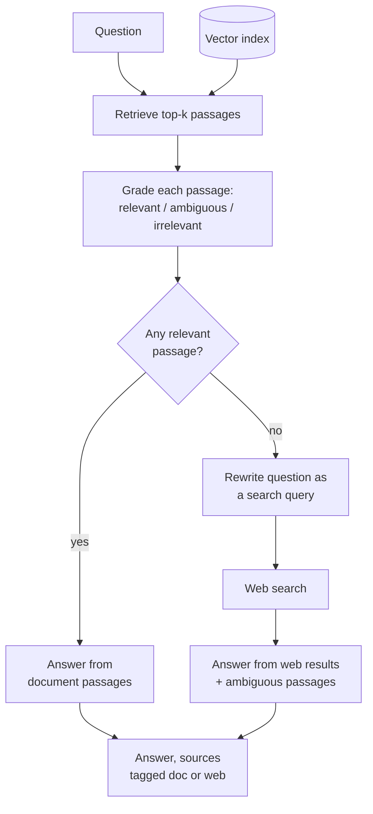

# CRAG (Corrective RAG)

## What it is

A retriever always returns something, even when the document doesn't cover the question, and the model then answers from unrelated text. Corrective RAG adds a check: a model grades each retrieved passage as relevant, ambiguous or irrelevant before it is used. If a relevant passage came back, it answers normally. If not, it rewrites the question as a search query, looks it up elsewhere (usually the web), and answers from that, tagging each source so the reader knows what came from the document and what came from the web.

## Ingestion flow

## Retrieval and generation flow

## Strengths

- **Catches bad retrieval.** An answer built on irrelevant passages looks like a good one; grading tells them apart.
- **Gaps get a defined response.** Questions outside the document trigger a fallback instead of a confident guess.
- **Reaches past the corpus.** The fallback can answer about things the documents don't cover.
- **Grades are a signal.** Consistently poor grades point to a retrieval or chunking problem.

## Limitations

- **Higher cost.** Extra model calls on every question, plus a web round-trip when the fallback fires.
- **The grader can be wrong.** Rejecting a good passage triggers a pointless search; accepting a bad one defeats the check.
- **Web results are unchecked.** They carry no accuracy guarantee and usually aren't graded themselves.
- **External calls may be forbidden.** Sending questions to a web search is often unacceptable for confidential or regulated data.
- **Checks sources, not the answer.** Nothing verifies the answer is supported by its context; Self-RAG does that.

## Where to use it

- Corpora known to be incomplete, like support docs that lag the product.
- Domains where a confidently wrong answer is worse than a slow one.
- Assistants with a curated core corpus that sometimes need to reach past it.
- Not where external lookups are prohibited, unless the fallback becomes a refusal.

## In this demo

- A LangGraph `StateGraph` with five nodes:
  - `retrieve`: `$vectorSearch` on `rag_crag`.
  - `grade`: one structured-output call labelling every passage relevant, irrelevant or ambiguous.
  - Conditional edge: to `generate` if at least one passage is relevant, otherwise to `rewrite_query`.
  - `rewrite_query`: turns the question into a short keyword query for `web_search` (`ddgs`, no API key).
  - `generate`: answers from whichever context applies, every source tagged `[doc, p.N]` or `[web]` in the prompt.
- Fallback is binary: one relevant passage is enough to skip the web search.
- If web search fails or returns nothing, the page warns and answers from any ambiguous passages instead of crashing.
- The page shows each passage's grade, the rewritten query and web results when the fallback fires, and the graph with this question's path outlined.
