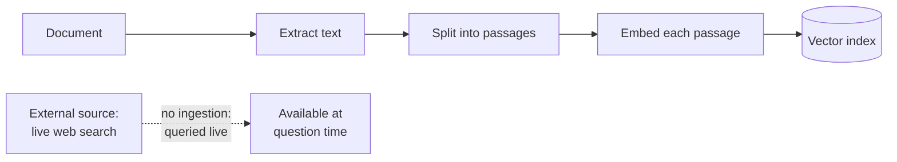
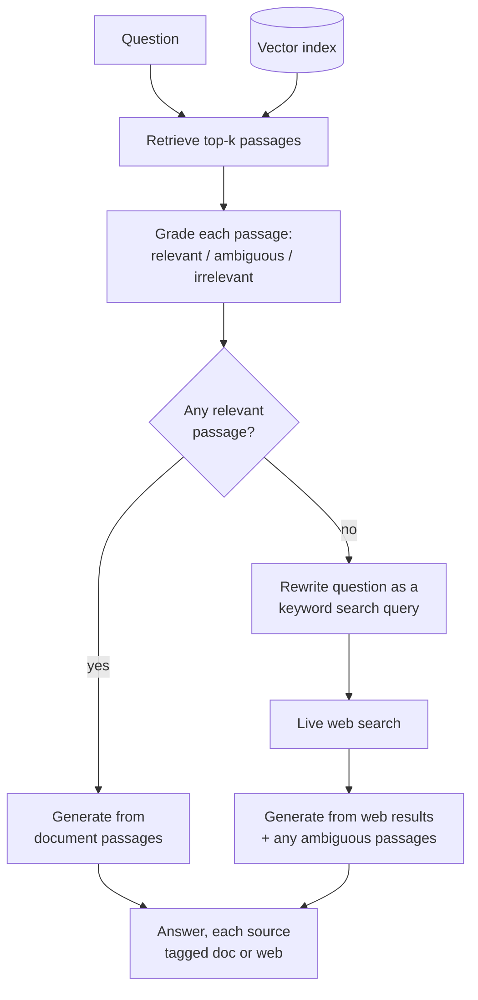

# CRAG (Corrective RAG)

## What it is

A retriever always returns something. Ask a question the document never addresses and you still get the top five passages — they are simply the five least-unrelated paragraphs available. Nothing in an ordinary pipeline distinguishes that from a genuine hit, so the passages go into the prompt looking exactly like evidence, and the model, told to answer from its context, usually obliges.

Corrective RAG inserts the missing step: **grade the retrieved passages before trusting them, and do something else when they fail.**

A grading call reads each passage against the question and labels it — relevant, irrelevant, or ambiguous (on-topic but not an answer by itself). That grade drives a decision. If something genuinely relevant came back, generate normally. If nothing did, the document does not contain the answer, and continuing to squeeze it is pointless. The pipeline instead turns the question into a search query and goes to an external source — typically a web search — then answers from what that returns.

Two ideas are doing the work. The first is **verification before generation**: checking retrieval quality while there is still time to act on it, rather than discovering the problem in the answer. The second is **graceful fallback**: treating "my corpus doesn't cover this" as a normal, expected condition with a defined response, instead of an unnoticed failure.

Keeping provenance straight matters in the fallback case. Once an answer can be built from the document, the open web, or both, each source needs tagging so the model and the reader can tell which claim came from where — a curated internal document and an arbitrary search result do not carry the same weight.

## Ingestion flow

## Retrieval and generation flow

## Strengths

- **It catches the failure that is otherwise invisible.** An answer built from irrelevant context reads exactly like a good one; grading is what tells them apart.
- **Coverage gaps stop being silent.** A question outside the corpus gets a defined response rather than a confident improvisation.
- **The fallback genuinely extends reach**, letting a system answer about things that postdate or fall outside its documents.
- **Provenance is explicit.** Tagged sources let the reader discount a web-sourced claim without discounting the whole answer.
- **The grades are diagnostic.** Consistently poor grades across many questions mean the retriever or the chunking is wrong, which is information a normal pipeline never surfaces.

## Limitations

- **Two extra model calls on every question**, plus a network round-trip whenever the fallback fires — several times a plain pipeline's cost.
- **The grader is a model and can be wrong both ways.** Calling a good passage irrelevant triggers a pointless web search; passing a bad one defeats the whole mechanism. A cheap model is normally used for grading, which is exactly where its weakness shows.
- **Collapsing the grades to a binary decision loses nuance.** If one relevant passage is enough to skip the fallback, a document with a single lucky match and four irrelevant passages proceeds as though retrieval succeeded.
- **The fallback source is ungoverned.** Web results carry no accuracy, recency or authority guarantee, and are typically not re-graded before use — corrective retrieval that ends in uncorrected context.
- **Escalating to the web is not always allowed.** In regulated, confidential or air-gapped settings, sending a rewritten question to an external search engine may be the least acceptable thing the pipeline could do.
- **Query rewriting is its own failure point.** A poor rewrite produces a poor search, and the fallback fails for a reason unrelated to the original retrieval.
- **It verifies the sources, not the answer.** Nothing checks whether the generated text is actually supported by the context it was given — that is Self-RAG's job.

## Where to use it

- Corpora known to be incomplete: support documentation that lags the product, policies silent on edge cases, manuals that predate the current model.
- Domains where a confidently wrong answer costs more than a slow one or an admission of ignorance.
- Open-domain assistants with a curated core corpus and a legitimate need to reach past it.
- Systems where retrieval quality needs monitoring in production — the grades are a usable live signal.
- Not where external lookups are prohibited, unless the fallback is replaced with a refusal or a handoff.

## In this demo

A LangGraph `StateGraph` with five nodes. `retrieve` runs `$vectorSearch` against `rag_crag`; `grade` makes one structured-output call labelling every passage relevant, irrelevant or ambiguous; the conditional edge sends the run to `generate` if at least one passage graded relevant, otherwise to `rewrite_query`, which turns the question into a short keyword query for `web_search` (`ddgs`, no API key). `generate` builds the answer from whichever context applies, with every source tagged `[doc, p.N]` or `[web]` in the prompt. If the web search fails or returns nothing, the page warns and answers from any ambiguous passages rather than crashing. The page shows each passage's grade, the rewritten query and web results when the fallback fires, and the graph with this question's path outlined.
