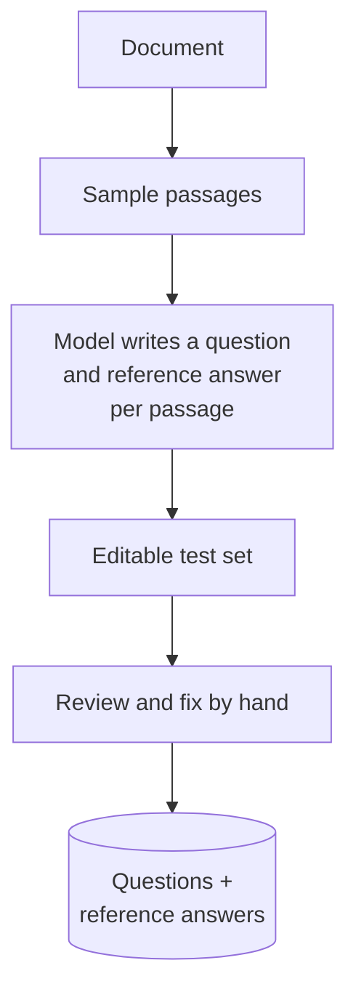
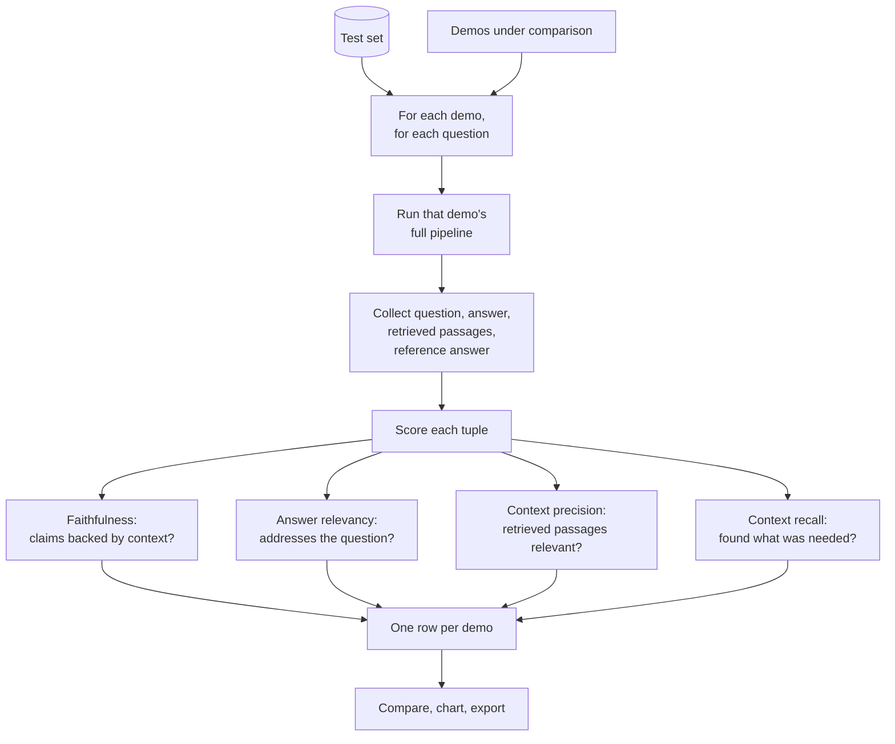

# RAG evaluation

## What it is

Reading a few answers is a poor test of RAG, because a fluent answer built from the wrong passages reads just like a good one. Evaluation runs each pipeline on the same test set of questions with reference answers, often generated from sampled passages and then reviewed by hand. It scores them with metrics that separate retrieval failures (did it find the right passages?) from generation failures (did the answer stick to them?). That tells you which half to fix, and whether a fancier technique actually helped.

- **Faithfulness**: is every claim in the answer backed by the retrieved passages?
- **Answer relevancy**: does the answer address the question?
- **Context precision**: how many of the retrieved passages were relevant?
- **Context recall**: did retrieval find everything the reference answer needed?

## Ingestion flow

## Retrieval and generation flow

## Strengths

- **Measurement over impression.** Identical inputs show whether extra complexity earned its cost.
- **Locates the fault.** Separate retrieval and generation scores tell you which half to work on.
- **Catches hidden hallucination.** An unfaithful answer slips past a human skim but not a faithfulness score.
- **Cheap test sets.** Generating questions from passages makes evaluation feasible at all.
- **Regression checks.** Prompt, model or chunking changes can be checked instead of hoped about.

## Limitations

- **Expensive.** Every question runs once per pipeline, plus several judge calls to score it.
- **The judge is a fallible model.** Scores are good for ranking pipelines on one test set, not as absolute quality.
- **Generated questions are biased easy.** Each comes from one passage, so multi-hop, comparison and no-answer cases go under-tested, and weak passages give weak questions.
- **Scores don't explain causes.** Pipeline A beating B doesn't say whether chunk size, top-k or the re-ranker made the difference.
- **Small sets are noisy and easy to overfit.** Ten questions can't separate close pipelines, and tuning to the set may not carry over to real questions.

## Where to use it

- Deciding whether a pricier technique pays off on your own documents.
- Diagnosing a weak pipeline: the low metric shows where to look.
- Guarding against regressions when changing a prompt, model, chunk size or retriever.
- Alongside reading real outputs, never instead of it.

## In this demo

- **Test set:** the chat model reads random passages of the uploaded PDF and writes one question and reference answer each into an editable table; fix them or replace them with your own.
- **Compared demos:** any demo with the shared `ingest(pdf_bytes, doc_id)` / `ask(question, doc_id) -> RagResult` contract. Currently Naive RAG, Hybrid search, Re-ranking and Contextual retrieval (default with-context variant; its first ingest also spends chat-model calls writing passage contexts). Each ingests the PDF into its own collection if needed and answers with its default settings.
- **Scoring:** Ragas over `(question, answer, retrieved contexts, reference answer)` tuples. Faithfulness and answer relevancy use an LLM judge; context precision and recall compare retrieved text with the reference answer.
- **Output:** a table, a bar chart and a CSV download; also sent to Langfuse as standalone score events when configured.
- **Judge provider:** Ragas can't use the project's provider fallback chain (it needs a plain LangChain chat model), so it uses the *first* configured provider only. A metric whose judge call fails comes back blank instead of failing the run.
- **Failed questions:** if a demo's `ask()` fails on a question, that question is dropped from its scoring and the excluded count is shown.
- **Quotas:** free tiers can be as low as 20 requests per day; a full run across several demos can use that up.
