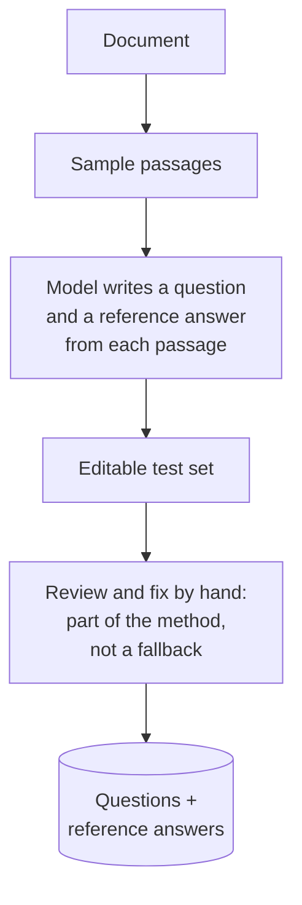
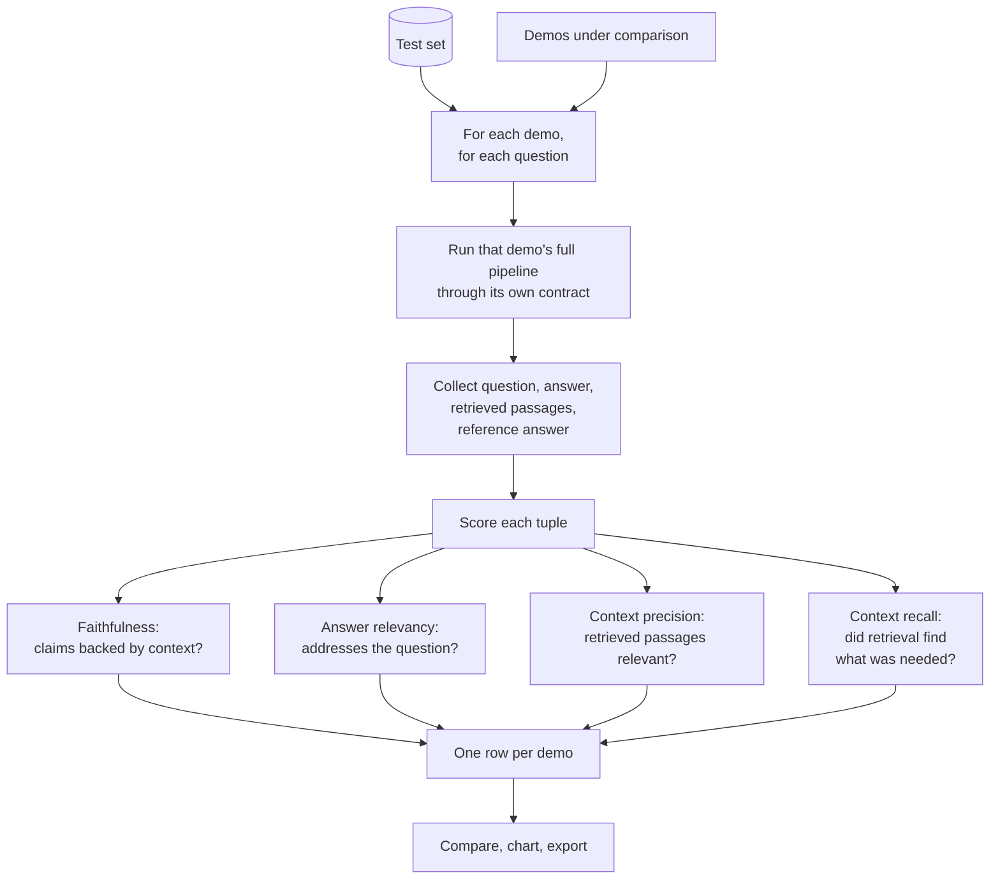

# RAG evaluation

## What it is

Every other page in this app argues that a technique helps. This one is about finding out whether it did.

The problem is that RAG quality is easy to assess badly. Reading a few answers and judging them plausible measures fluency, which language models supply regardless of whether retrieval worked. A confident answer built from irrelevant passages reads exactly like a good one, so eyeballing a handful of outputs systematically overestimates a system — and gives no way to compare two pipelines beyond a vague impression.

Systematic evaluation needs three things: a **test set** of questions with known good answers, a set of **metrics** computed the same way for every system, and the discipline to run every candidate against the identical inputs.

The test set is the hard part, because hand-writing questions and reference answers is slow. A practical shortcut is to generate them: sample passages from the document, and for each one have a model write a question that passage answers plus the answer itself. The passage guarantees the answer exists and is findable, which is exactly what a retrieval test needs. The catch is that generated questions inherit their passage's quality — a header or a boilerplate paragraph yields a worthless question — so reviewing and editing the generated set is part of the method, not a fallback.

The metrics matter more than the score. The useful ones separate **retrieval** failures from **generation** failures, because a single quality number tells you nothing about what to fix:

- **Faithfulness** — is every claim in the answer supported by the retrieved passages? This is the hallucination measure. It can be perfect on a useless answer and fails independently of whether the answer is correct.
- **Answer relevancy** — does the answer actually address the question, rather than adjacent facts?
- **Context precision** — of the passages retrieved, how many were relevant? Low precision means noise crowding the prompt.
- **Context recall** — of what the reference answer needed, how much did retrieval actually find? This is the one that catches a retriever missing the answer entirely.

Read together they localise the fault. Low recall with high faithfulness means retrieval is the problem and generation is behaving honestly. High recall with low faithfulness means retrieval found the answer and generation ignored it. Those two need opposite fixes, and no single score distinguishes them.

Several of these need a model to judge them, which is the method's central caveat: an LLM judge is itself a fallible system, so the numbers are a directional instrument for comparison, not ground truth. They are reliable for ranking two pipelines on the same test set and unreliable as absolutes.

## Ingestion flow

## Retrieval and generation flow

## Strengths

- **It replaces impression with measurement.** Comparing techniques on identical inputs is the only way to know whether added complexity earned its cost.
- **The metrics localise the fault.** Splitting retrieval quality from generation quality tells you which half to work on, which a single score never does.
- **It catches the failure fluency hides.** An unfaithful answer is invisible to a human skim and obvious to a faithfulness score.
- **Generated test sets make evaluation feasible.** The barrier is usually effort, and sampling passages lowers it enough that evaluation actually happens.
- **It gives you a regression test.** Once a test set exists, a prompt change or model upgrade can be checked instead of hoped about.
- **It disciplines the whole project.** Knowing a technique will be measured changes which ones you bother building.

## Limitations

- **By far the most expensive thing here.** Every question is answered once per compared demo, and each answer costs several more calls to score. Three demos over ten questions is easily a hundred-plus calls.
- **The judge is a fallible model.** Scores are directional, useful for ranking systems against each other on one test set, and not trustworthy as absolute quality.
- **Generated questions inherit their passage.** A passage that is mostly a header or a table yields a weak question, and an unreviewed test set measures the generator as much as the pipeline.
- **Passage-derived questions are biased easy.** Each is answerable from exactly one passage, so this systematically under-tests multi-hop, comparison and absent-answer behaviour — which is where the interesting techniques differ most.
- **Comparing whole pipelines does not isolate a cause.** Knowing demo A beat demo B tells you nothing about whether chunk size, top-k or the re-ranker was responsible.
- **Four metrics are not quality.** Tone, format, usefulness, calibrated uncertainty and knowing when to refuse are all unmeasured here.
- **Small test sets are noisy.** Ten questions cannot separate pipelines whose real difference is a few percent, and the numbers will look more decisive than they are.
- **A test set can be overfitted.** Tuning until the numbers rise optimises for the test set, and the gains may not survive contact with real questions.

## Where to use it

- Deciding whether a more expensive technique is worth it on *your* documents, rather than trusting that it generally helps.
- Diagnosing a pipeline that underperforms — the metric that is low tells you where to look first.
- Guarding against regressions when changing a prompt, a model, a chunk size or a retriever.
- Building intuition about what these measures mean, by watching them move across techniques on the same questions.
- Not as a substitute for reading actual outputs. The scores say which pipeline is better; only reading answers tells you whether either is good enough.

## In this demo

The chat model reads random passages of the uploaded PDF and writes one question and reference answer per passage into an editable table, so generated questions can be fixed or replaced with hand-written ones. Any demo following the shared `ingest(pdf_bytes, doc_id)` / `ask(question, doc_id) -> RagResult` contract can be compared — currently Naive RAG, Hybrid search, Re-ranking and Contextual retrieval (its default with-context variant, whose first ingest also spends chat-model calls writing passage contexts). Each ingests the PDF into its own collection if it hasn't already, then answers every question with its own default settings. Scoring uses Ragas over `(question, answer, retrieved contexts, reference answer)` tuples on the four metrics above; faithfulness and answer relevancy need an LLM judge, while context precision and recall are computed from the retrieved text and the reference answer. Results render as a table, a bar chart and a CSV download, and are pushed to Langfuse as standalone score events when it is configured.

Two operational notes. Ragas can't use this project's provider fallback chain — it needs a plain LangChain chat model to introspect and mutate directly — so scoring runs on the *first* configured provider only, and a metric that can't get a judge call through comes back blank rather than failing the run. If a demo's `ask()` fails outright for a question, that question is dropped from its scoring and the excluded count is shown, with the rest of its row still reported. Free-tier daily quotas can be as low as 20 requests per day, so a full run across several demos can exhaust one.
