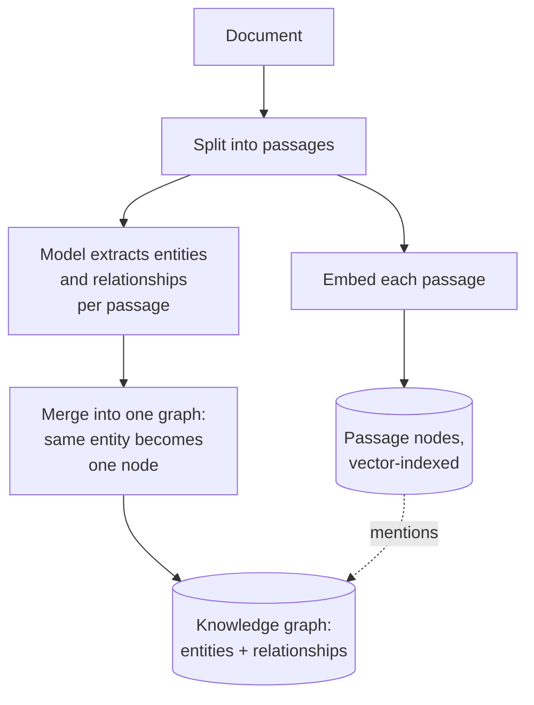
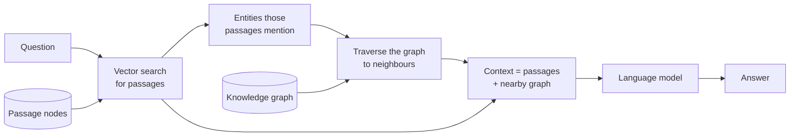

# GraphRAG

## What it is

GraphRAG builds a knowledge graph from the document: at ingest, a model pulls out **entities** (people, companies, parts) and the **relationships** between them. At question time, vector search finds matching passages, then the graph is followed from the entities in those passages to their neighbours. This helps with questions about connections ("who worked with whom?") whose answer is spread across the document and never stated in one passage.

## Ingestion flow

## Retrieval and generation flow

## Strengths

- **Answers relationship questions.** Facts scattered across the document meet on the same entity node.
- **Reaches beyond similar text.** Traversal finds facts that don't resemble the question but are linked to ones that do.
- **Explainable.** The answer rests on a visible path through named entities, not just a similarity score.
- **Falls back gracefully.** Passages are kept, so it still works like normal vector RAG when the graph doesn't help.

## Limitations

- **Expensive ingest.** One model call per passage, versus none for embedding-only RAG; improving it means re-extracting everything.
- **Extraction sets the ceiling.** Relationships the model misses are silently gone.
- **Duplicate entities.** "Marie Curie" and "M. Curie" become separate nodes unless merged, splitting the connections you wanted.
- **Traversal depth is a guess.** One hop misses things; two hops can flood the context with noise.
- **Inconsistent, unverified graph.** Without a schema the same fact gets different relationship names, and contradictions stay as conflicting edges. KAG adds a schema for this.

## Where to use it

- Material built around entities: biographies, org records, case files, specs with component dependencies.
- Questions about connections: who with whom, what depends on what.
- Investigations where an auditable path matters as much as the answer.
- Not for simple fact lookup, where the ingest cost buys nothing.

## In this demo

- Extraction: `langchain_neo4j.LLMGraphTransformer` with the fast chat model. Up to `GRAPH_RAG_MAX_CHUNKS` passages are extracted, `GRAPH_RAG_EXTRACT_CONCURRENCY` at a time. Passages past the cap are still embedded and retrievable, just without graph expansion.
- Every passage is embedded with `bge-small-en-v1.5` and stored as a `Document` node in Neo4j with a vector index, linked to its entities via `MENTIONS` (`include_source=True`).
- Ask: vector search for top-k passage nodes → Cypher walks `MENTIONS` to their entities and one hop further to neighbours → one chat-model call over passages plus that neighbourhood.
- The page shows the whole extracted graph and, after a question, the subgraph that fed the answer with mentioned entities highlighted.
- Neo4j AuraDB Free pauses when idle; ingest and ask show a clear message instead of crashing.
- Entity nodes are created with `apoc.merge.node`, so a self-hosted Neo4j without APOC fails ingest (with a caught error).
- GraphRAG and KAG share one Aura database, isolated only by `doc_id` and `demo` properties. Two documents mentioning the same `Person` merge into one node, and since `apoc.merge.node` sets properties only on creation, the first ingest's tags stick. "Clear my data" deletes only nodes tagged with this demo and doc, so orphaned nodes can survive. Fine for one document at a time; not real multi-tenant isolation.
