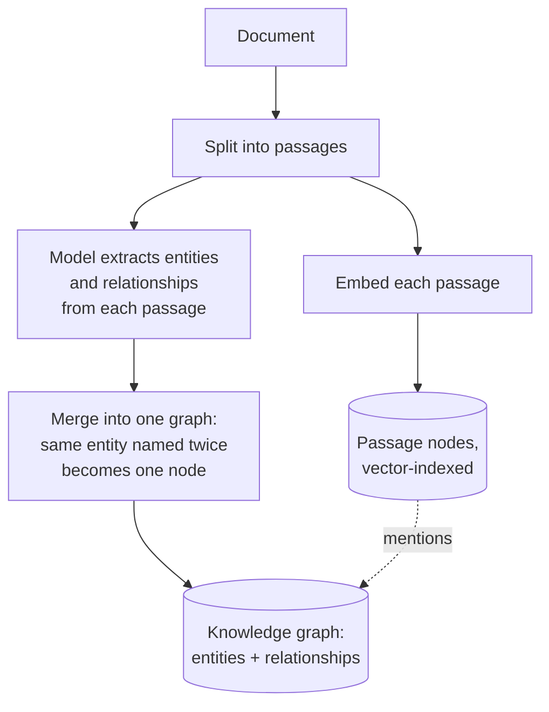
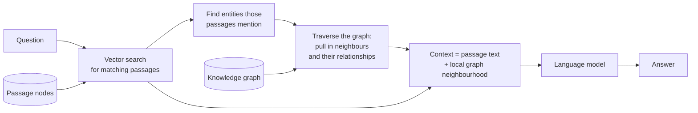

# GraphRAG

## What it is

Vector retrieval treats a document as a bag of independent passages. That works when an answer sits inside one passage, and fails when the answer *is a relationship* — something the document implies across several places but never states in one.

*"Who did this researcher collaborate with?"* The document may mention a joint paper in one section, a shared laboratory in another, and a co-authored patent in a third. No passage contains the list. Retrieval returns the three best-matching paragraphs, which may be three descriptions of the same collaboration, and the model answers from whichever fragment it got.

GraphRAG changes what gets stored. At ingest, a language model reads each passage and extracts **entities** (a person, an organisation, a place, a component) and **relationships** between them (*worked with*, *founded*, *depends on*). Those become nodes and edges in a knowledge graph, accumulated across the whole document so that facts stated far apart end up as edges on the same node. The passages are kept and embedded too, with links recording which passage mentioned which entity — the graph is an index over the text, not a replacement for it.

Retrieval then works in two moves. Vector search finds the passages that best match the question, exactly as before. Then the graph is **traversed** from the entities those passages mention, pulling in neighbouring entities and their relationships. The context handed to the model is the retrieved text *plus* a local map of how the things in it connect. Facts that were never close together in the document arrive together, because the graph put them on the same node.

The trade is stark. Extraction costs a model call per passage, making ingest far more expensive than embedding alone, and the resulting graph is only as good as that extraction. In exchange, relationship questions become answerable and the answer's reasoning is inspectable as a path through named entities rather than a similarity score.

## Ingestion flow

## Retrieval and generation flow

## Strengths

- **Relationship questions become answerable.** Connections scattered across a document are collected on one node and arrive together.
- **It beats the locality assumption.** Vector search can only return text that resembles the question; graph traversal reaches facts that resemble nothing in it but are linked to something that does.
- **Reasoning is inspectable as a path.** "These entities, connected this way" is a far better explanation than a similarity score, and it is checkable by a human.
- **Entity mentions get consolidated.** The same subject discussed under different phrasings in different sections converges on one node.
- **The graph is reusable.** Once built it supports browsing, summarisation and analytics, not just question answering.
- **Text is still there.** Because passages are kept and linked, this degrades to ordinary vector RAG rather than failing when the graph doesn't help.

## Limitations

- **Ingest is expensive and slow** — one model call per passage, against zero for embedding-only pipelines — which is why extraction is usually capped and run concurrently.
- **Extraction quality sets the ceiling.** A cheap model misses relationships a strong one would catch, and everything downstream inherits those omissions silently.
- **Entity resolution is the hard unsolved part.** "Marie Curie", "Curie" and "M. Curie" become three nodes unless something merges them, fragmenting exactly the connections the technique exists to find.
- **Traversal depth is a fixed guess.** One hop misses two-hop relationships; two hops pull in enough of the graph to drown the real signal.
- **No schema means no consistency.** Accepting whatever relationship types the model invents makes the graph easy to build and inconsistent to query — the same fact may be *works at*, *employed by* and *member of* in three passages. KAG constrains this deliberately.
- **Nothing is normalised or verified.** Contradictions across passages become contradictory edges, with no confidence, no provenance weighting and no resolution.
- **Re-extraction is the only way to improve it.** A better model or prompt means paying the full ingest cost again.
- **Graph storage is another system** to run, secure and keep isolated per tenant.

## Where to use it

- Entity-and-relationship shaped material: biographies, organisational records, case files, incident reports, histories, technical specifications describing components and their dependencies.
- Questions that are explicitly about connection — who with whom, what depends on what, how A relates to B.
- Corpora where the same entities recur across many documents and the value is in cross-document links no single document states.
- Investigative and analytical work, where an auditable path through named entities matters as much as the answer.
- Not for straightforward factual lookup, where the ingest cost buys nothing a vector index wouldn't have given you.

## In this demo

Passages go through `langchain_neo4j.LLMGraphTransformer`, which asks the fast chat model to pull entities and relationships, with up to `GRAPH_RAG_MAX_CHUNKS` passages extracted `GRAPH_RAG_EXTRACT_CONCURRENCY` at a time (extraction is the slow, costly stage). Every passage is also embedded with `bge-small-en-v1.5` and stored as a `Document` node in Neo4j with a vector index, linked to its entities by `MENTIONS` relationships (`include_source=True`). Asking runs a vector search for top-k passage nodes, a Cypher query walking their `MENTIONS` edges to the entities those passages discuss and one hop further to neighbours, then one chat-model call over the passage text plus that neighbourhood. Passages beyond the cap remain embedded and retrievable, just without graph expansion. The page shows the whole extracted graph and, after a question, the specific subgraph that fed the answer with the mentioned entities highlighted.

Two shared-infrastructure caveats. Neo4j AuraDB Free pauses after inactivity — both ingest and ask show a clear message rather than crashing — and entity node creation goes through `apoc.merge.node`, so a self-hosted Neo4j without the APOC plugin fails ingest with a caught error. GraphRAG and KAG share one Aura database and isolate only by `doc_id` and `demo` properties, not by name: two documents both mentioning the same `Person` merge into one physical node, and because `apoc.merge.node` sets properties only on creation, whichever ingest made it first keeps its tags permanently. A later demo's ingest cannot retag it, and "Clear my data" removes only nodes currently tagged with this demo and doc, so an orphaned node can survive. Fine for exploring one document at a time; not real multi-tenant isolation.
