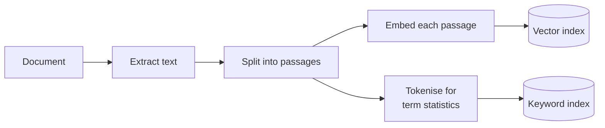

# Hybrid search

## What it is

Hybrid search runs a vector search (matches meaning, but can miss exact terms like part numbers) and a keyword search (matches exact words, but misses paraphrase) side by side, then merges the two ranked lists. Their raw scores aren't comparable, so the usual merge is reciprocal rank fusion (RRF): each passage scores `1 / (k + rank)` from each list it appears in, and those are added up. Passages ranked high by both win, and each search covers the other's blind spot.

## Ingestion flow

## Retrieval and generation flow

## Strengths

- **Finds exact terms and paraphrase.** Quoted IDs are found without losing meaning-based matching.
- **No score calibration.** Merging by rank works across query types without tuning.
- **Degrades gracefully.** If one search finds nothing useful, the other carries the question.
- **Cheap upgrade.** A second search and some arithmetic; no extra model calls.

## Limitations

- **Two indexes to build and keep in sync.**
- **One global balance.** The same vector/keyword weighting applies to every question, though the right mix varies.
- **Rank fusion drops magnitude.** A strong match and a weak one look alike if they rank next to each other.
- **Weak on short documents.** Keyword statistics need a corpus; on a small one the two lists converge.
- **Still only retrieves.** It never checks relevance or notices when the answer isn't in the document.

## Where to use it

- Text full of quoted identifiers: product codes, error codes, SKUs, statute numbers.
- Support, legal and compliance content where a near-miss is a wrong answer.
- As the first upgrade from a vector-only baseline.

## In this demo

- One collection, `rag_hybrid`, with a `vector_index` and a `text_index`.
- Vector: `$vectorSearch`. Keyword: MongoDB's BM25-based `$search`.
- Fusion is hand-written weighted RRF: `vector_weight × 1/(rrf_k + vector_rank) + (1 − vector_weight) × 1/(rrf_k + keyword_rank)`. `rrf_k` is fixed in code; `vector_weight` is a sidebar slider.
- Splitting: the same hand-written recursive splitter as Naive RAG, duplicated (not imported) so the demo stands alone.
- No LangChain.
- Each question runs the full pipeline three times (vector-only, keyword-only, fused), each with its own answer and evidence. The slider affects only the fused column.
