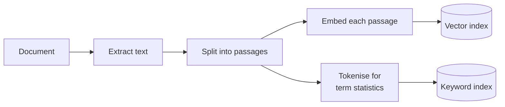
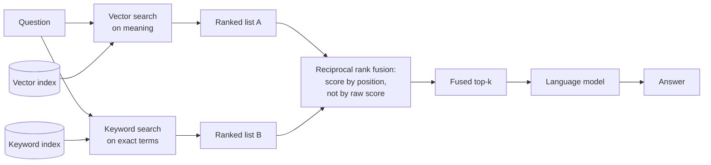

# Hybrid search

## What it is

Vector search and keyword search fail in opposite directions, and hybrid search is the observation that you can simply run both.

**Vector search** matches on meaning. It will find a passage about "quarterly earnings" from a question about "how much money the company made", because the two sit near each other in the embedding space. What it cannot do is guarantee an exact term: embeddings compress text into a few hundred numbers, and a specific part number, error code or surname is precisely the detail that compression discards. A passage that merely sounds relevant can outrank the one containing the literal string.

**Keyword search** — BM25 and its relatives — matches on words, weighting terms that are rare in the collection and common in the passage. It is unbeatable at exact terms and completely blind to paraphrase: ask about "revenue" when the document says "turnover" and it returns nothing.

So run both and merge the two ranked lists. The merge is the interesting part, because the two systems' scores are not comparable — a cosine similarity of 0.82 and a BM25 score of 14.7 mean nothing to each other, and their ranges shift per query. **Reciprocal rank fusion** sidesteps this by throwing the scores away and keeping only each passage's *position* in each list. Every passage scores `1 / (k + rank)` from each list it appears in, and those are added up. A passage ranked highly by both wins; a passage ranked first by one and absent from the other still places well. The constant `k` controls how sharply rank 1 beats rank 5 — small `k` makes the top position dominate, large `k` flattens the list.

The result is a retriever with neither system's blind spot, at the cost of maintaining two indexes.

## Ingestion flow

## Retrieval and generation flow

## Strengths

- **It removes a whole class of miss.** Exact identifiers quoted in a question are found reliably, without giving up the paraphrase tolerance that made vector search worth having.
- **Fusion by rank needs no calibration.** Because raw scores never meet, the merge works across query types and index sizes without per-query tuning.
- **Graceful when one side is useless.** A question with no distinctive terms simply gets a keyword list that contributes little, and the vector side carries it. Nothing breaks.
- **A small, well-understood upgrade.** Compared with re-ranking or contextual retrieval it adds no model calls at question time — just a second search and an arithmetic merge.

## Limitations

- **Two indexes to build, keep queryable and keep in sync**, and more ingest-time setup than a single vector store.
- **The weighting is global, not per-query.** One vector/keyword balance is applied to every question, when the right balance obviously differs between "what is the refund policy" and "what does error E-4021 mean".
- **Fusion discards magnitude.** Throwing away scores is what makes the merge robust, but it also means a passage that matched overwhelmingly well and one that matched adequately are treated as neighbours if they rank adjacently.
- **`k` is a real dial that is rarely tuned**, and its effect is invisible until you compare outputs across values.
- **Keyword statistics need a corpus to be meaningful.** On a short document, term rarity is noise, and the two lists tend to converge — fusion has little to fuse.
- **It still only retrieves.** Nothing here reads the question and the passage together, checks whether the result is relevant, or recovers if the answer simply isn't in the document.

## Where to use it

- Documents mixing prose with identifiers people quote verbatim: product codes, error codes, SKUs, statute numbers, drug names, ticket IDs.
- Technical support, legal and compliance corpora, where the exact term carries the meaning and a near-miss is a wrong answer.
- As the first upgrade from a vector-only baseline, especially when evaluation shows misses on passages a plain keyword search would have caught.
- Any collection whose users mix natural-language questions with pasted-in strings.

## In this demo

One collection (`rag_hybrid`) carries both a `vector_index` and a `text_index`. Vector retrieval is `$vectorSearch`; keyword retrieval is MongoDB's BM25-based `$search`. Fusion is written out by hand as weighted RRF — `vector_weight × 1/(rrf_k + vector_rank) + (1 − vector_weight) × 1/(rrf_k + keyword_rank)` — with `rrf_k` fixed in code and the weight on a sidebar slider. Splitting reuses the same hand-written recursive splitter as Naive RAG, duplicated rather than imported so the demo stands alone. No LangChain. One question runs the full pipeline three times, once per mode, so vector-only, keyword-only and fused each show their own answer and evidence; the slider affects the fused column only.
