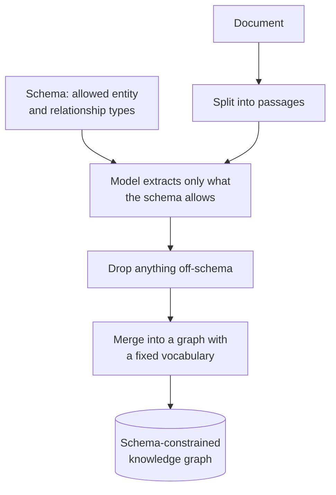
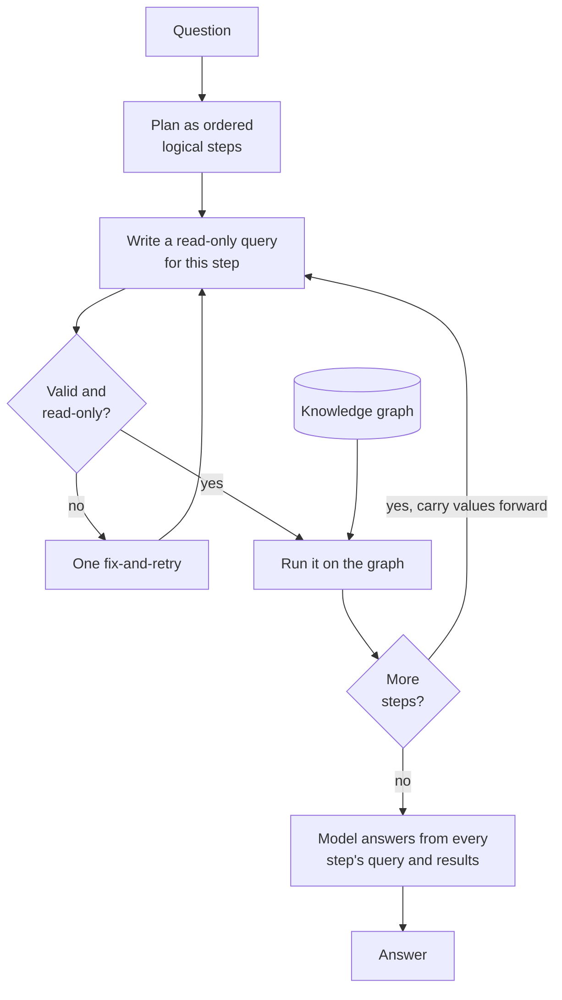

# KAG (Knowledge-Augmented Generation)

## What it is

KAG builds a knowledge graph like GraphRAG, but with a fixed **schema**: you declare which entity and relationship types exist, and extraction keeps only those. Because the vocabulary is known, the model can answer a question by planning it as a chain of steps and writing an exact graph query for each, passing results from one step into the next. That turns multi-step questions ("who founded the company that employs this person's manager?") into precise lookups instead of similarity guesses.

## Ingestion flow

## Retrieval and generation flow

## Strengths

- **Queryable graph.** A fixed vocabulary means a query knows what each relationship is called.
- **Less extraction noise.** Off-schema inventions are dropped at ingest instead of polluting the graph.
- **Real multi-step reasoning.** Chained queries reach facts that no single passage resembling the question contains.
- **Exact retrieval.** A query matches or it doesn't; there is no similarity threshold to tune.
- **Fully auditable.** Every step is a literal query and result table anyone can re-run.

## Limitations

- **The schema is a silent filter.** Anything relevant but undeclared is dropped, and you only notice from an incomplete answer.
- **You must know the domain up front.** Designing the schema is hard for an unfamiliar corpus, and changing it means re-extracting everything.
- **Valid queries can match nothing.** The model knows the type names, not the data, and an empty early step empties every later one with no backtracking.
- **Generated queries are a security boundary.** They must be restricted to read-only before they run.
- **Cost adds up.** A planning call, a call per step, retries and a final answer call, on top of GraphRAG's extraction cost.

## Where to use it

- Stable, well-understood domains: org data, supply chains, regulation, clinical or financial records.
- Relational questions that need real chaining across entities.
- Settings where every answer must be checkable by an auditor.
- Not for exploring unfamiliar corpora; GraphRAG's open extraction fits that better.

## In this demo

- **Schema:** a JSON list of entity types (`Person`, `Organization`) and relationship types (`WORKS_AT`, `FOUNDED`), edited in the sidebar. Invalid JSON shows the parse error and disables ingest.
- **Extraction:** `langchain_neo4j.LLMGraphTransformer(allowed_nodes=..., allowed_relationships=...)`, `strict_mode` on by default, over up to `KAG_MAX_CHUNKS` passages, `KAG_EXTRACT_CONCURRENCY` at a time.
- **Asking:** one call splits the question into steps, then one call per step writes a read-only Cypher query filtered by `{doc_id: $doc_id, demo: 'kag'}`, run via `Neo4jGraph.query()` with one fix-and-retry. A three-step question costs about five model calls.
- **Safety:** write keywords (`CREATE`, `MERGE`, `DELETE`, `SET`, `CALL`, …) are rejected before reaching Neo4j and the step shows "Blocked".
- **Empty steps** are reported to later steps, so the final answer names the gap instead of guessing.
- **Chaining caveat:** earlier values are pasted into the next query's text, not bound as parameters, so names with quotes or odd punctuation can break it.
- **No introspection:** unlike SQL RAG, the model is told the type names, not what data exists.
- **Storage:** shares one Neo4j AuraDB Free database with GraphRAG, with the same pausing behaviour and `doc_id`/`demo` tagging caveat described in its README.
