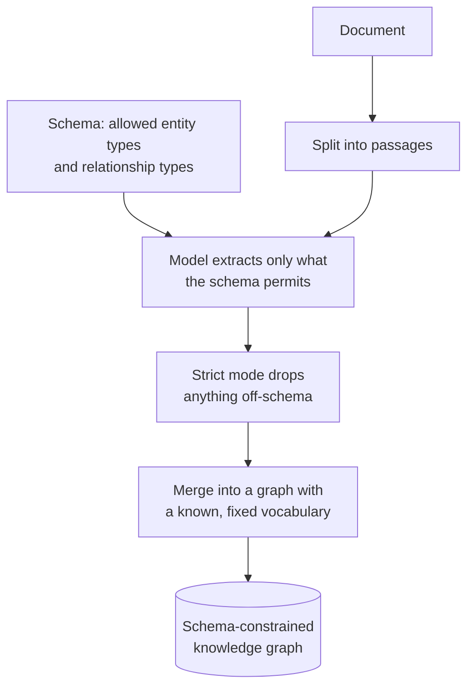
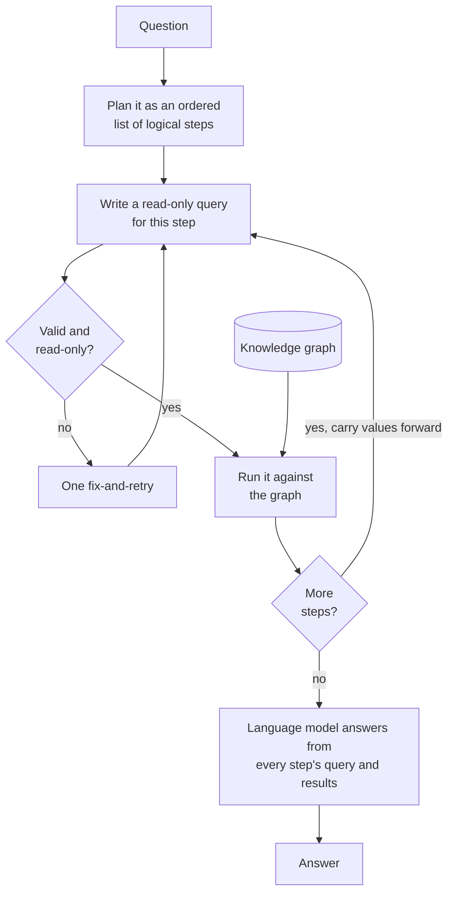

# KAG (Knowledge-Augmented Generation)

## What it is

KAG takes GraphRAG's knowledge graph and adds the two things that make a graph behave like a database rather than a pile of extracted text: **a schema**, and **queries**.

The schema comes first. Instead of letting the model name whatever entities and relationships it notices, you declare the vocabulary up front — these node types, those relationship types, and nothing else. Extraction is then constrained to that vocabulary, and anything outside it is dropped rather than invented. This is the direct answer to open extraction's central weakness: a graph where the same fact appears as *works at*, *employed by* and *member of* is not queryable, because no query can know which form to ask for. Fixing the vocabulary fixes that, and the price is that anything true of the document but outside the schema becomes invisible to the system.

Queries come second, and they change what retrieval means. GraphRAG retrieves by vector similarity and then walks outward from whatever it found. KAG instead plans the question as a **sequence of logical steps** and writes an explicit query for each one, run against the graph. Values found by one step are carried into the next, so *"who founded the company that employs this person's manager"* becomes: find the person's manager, find that manager's employer, find that company's founder — three queries, each depending on the last.

The consequence is that retrieval becomes deterministic and exact. A query either matches or it doesn't; there is no similarity score and no threshold. Multi-step relational questions — the ones where vector retrieval is weakest, because the intermediate entities appear in no passage resembling the question — become straightforward, and every step is a re-runnable query with a result table, which is about as auditable as retrieval gets.

The shift in failure mode is the thing to understand. Vector retrieval degrades gracefully: a poor match still returns something roughly related. A query that matches nothing returns nothing at all, and a query written against a schema the data doesn't quite populate fails completely rather than approximately.

## Ingestion flow

## Retrieval and generation flow

## Strengths

- **A fixed vocabulary makes the graph queryable.** You can write a query knowing what the relationship is called, which open extraction never guarantees.
- **Extraction noise is filtered at the source.** Off-schema inventions are dropped at ingest rather than polluting the graph and surfacing later as junk.
- **Multi-step relational questions work properly**, including ones whose intermediate entities appear in no passage resembling the question.
- **Retrieval is exact, not approximate.** A match is a match — no similarity threshold to tune, no near-miss ranked above a hit.
- **Maximum auditability.** Every step is a literal query and a result table, re-runnable by hand and checkable by someone who knows the domain.
- **The schema is documentation.** Declaring what matters makes the system's model of the domain explicit and reviewable.

## Limitations

- **The schema is a hard filter and a silent one.** Anything relevant but undeclared is invisible, and nothing tells you it was dropped — you find out by getting an incomplete answer.
- **You must know the vocabulary in advance**, which is exactly what you don't know when exploring an unfamiliar corpus.
- **Query generation is harder than it looks.** Knowing the type names is not knowing what data exists, so a model can write a perfectly valid query that matches nothing.
- **Nothing degrades gracefully.** An empty result is empty; there is no partial credit, and an early empty step propagates into every step after it.
- **Cost grows per step** — a planning call, a call per step to write its query, retries, and a final composition call.
- **No backtracking.** A wrong early step is not reconsidered, and the chain continues on a bad foundation.
- **Generated queries are a security boundary.** Model-written queries must be constrained to read-only operations before execution; this is a guard rail, not an optional nicety.
- **Schema changes mean re-extraction**, paying the full ingest cost again.
- **Two hard problems at once.** It inherits extraction quality and entity resolution from GraphRAG, then adds query correctness on top.

## Where to use it

- Well-understood domains with a stable, known vocabulary: organisational data, supply chains, regulatory relationships, clinical or financial records.
- Multi-part relational questions requiring genuine chaining, not just retrieval of one relevant passage.
- Settings where answers must be defensible to an auditor, because every step is a query someone can re-run and check.
- Corpora where a curated, consistent graph will be reused across many applications, justifying the schema work.
- Not for exploration, open-domain corpora, or anywhere the interesting facts aren't known ahead of time — GraphRAG's open extraction is the better fit there.

## In this demo

The schema is a JSON list of entity types (`Person`, `Organization`) and relationship types (`WORKS_AT`, `FOUNDED`) edited in the sidebar; invalid JSON shows the parse error and disables ingest rather than crashing. Extraction uses `langchain_neo4j.LLMGraphTransformer(allowed_nodes=..., allowed_relationships=...)` with `strict_mode` on by default, over up to `KAG_MAX_CHUNKS` passages at `KAG_EXTRACT_CONCURRENCY` at a time. Asking makes one call to break the question into ordered steps, then one call per step to write a read-only Cypher query — told to filter every node by `{doc_id: $doc_id, demo: 'kag'}` and to reuse concrete values surfaced by earlier steps — run via `Neo4jGraph.query()`, with one fix-and-retry on failure. Write keywords (`CREATE`, `MERGE`, `DELETE`, `SET`, `CALL`, …) are rejected before reaching Neo4j and the step shows "Blocked"; a step returning nothing is reported explicitly to later steps so the final answer names the gap instead of guessing. A three-step question costs roughly five model calls.

Chaining works by asking the model to paste concrete values from earlier results into the next query's text rather than binding real parameters — readable, but fragile if a name contains quotes or unusual punctuation. Unlike SQL RAG, there is no introspection step: the model is told the type names, not what data exists. This demo shares one Neo4j AuraDB Free database with GraphRAG and inherits the same pausing behaviour and `doc_id`/`demo` tagging caveat described in its README.
