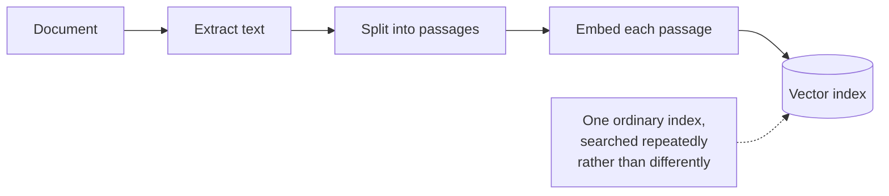
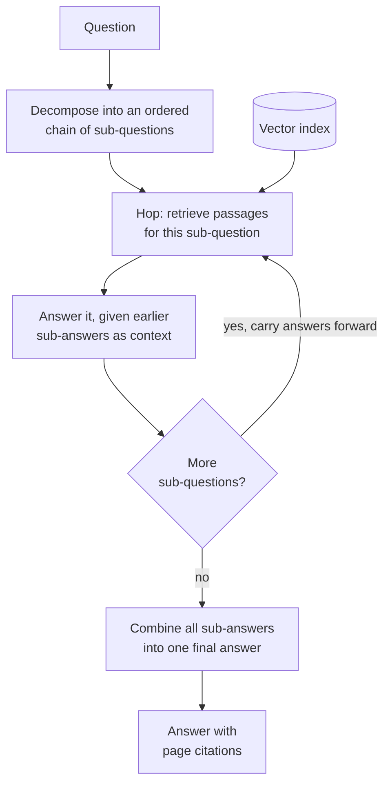

# Multi-hop RAG

## What it is

Some questions cannot be answered by any single passage, no matter how good retrieval is.

*"Which of the two suppliers named in the logistics section has the longer contract term?"* The answer exists in the document, but never in one place: one passage names the suppliers, two others state their terms, and the comparison itself is written down nowhere. A single top-k retrieval scores every passage against the whole question at once. The passage stating a contract term does not resemble that question — it doesn't mention suppliers or comparison — so it tends to rank below passages that merely sound on-topic. Retrieval doesn't fail loudly; it returns the wrong things confidently, and the model answers from a partial picture.

The fix is to stop treating retrieval as one event. **Decompose** the question into an ordered chain of simpler sub-questions, each answerable by one retrieval. Then **hop**: answer the first, and carry its answer into the second — because the second often cannot be asked until the first is answered. *"What is Supplier B's contract term?"* is not a question you can pose until you know a supplier is called B. Each hop retrieves fresh passages for its own sub-question, so the corpus is searched with a query that actually matches the text being looked for. Finally, **combine** the sub-answers into a single answer to the original question.

That dependency is what distinguishes this from simply retrieving more. Fetching twenty passages instead of five still asks one question once. Multi-hop asks a *different, better* question at each step, with each query informed by what the previous step found.

The structural limitation is that the plan is made before any retrieval happens. The decomposer sees only the question, so it has to guess at the document's shape, and if a hop's actual answer reveals that a different next step was needed, there is no mechanism to change the plan. Errors also flow strictly downhill: each hop treats earlier sub-answers as established fact.

## Ingestion flow

## Retrieval and generation flow

## Strengths

- **It answers questions a single pass structurally cannot** — comparisons, aggregations across sections, and any chain where a later fact depends on an earlier one.
- **Each retrieval gets a query that matches its target.** A focused sub-question retrieves far better than a compound question that resembles nothing in the document.
- **Later hops are better informed**, because concrete names and values found earlier sharpen the queries that follow.
- **The reasoning is legible.** The sub-question chain is the model's plan written down, and a wrong answer can be traced to the hop that produced it.
- **Partial results survive.** A hop that finds nothing leaves a specific, visible gap rather than corrupting the whole answer.

## Limitations

- **Cost scales with hop count** — a decompose call, a retrieval and a generation per hop, and a combine call. A two-hop question is already four-plus model calls.
- **Latency is sequential by definition.** Hops depend on each other, so they cannot be run in parallel; the user waits for the whole chain.
- **The plan is fixed before any evidence arrives.** If a hop's answer shows an unplanned step is needed, nothing adds it.
- **Errors compound.** Each hop takes earlier sub-answers as given, so one wrong early answer quietly poisons everything after it, with no cross-hop verification.
- **Decomposition can simply be wrong** — splitting along lines the document isn't organised by, producing sub-questions no passage answers.
- **Simple questions pay the full overhead** when the pipeline always decomposes, which is why this is often a route inside a router rather than a pipeline on its own.
- **More hops is not better.** Each one adds cost and another chance to go wrong, so the maximum is a real quality dial.

## Where to use it

- Comparison questions, where a single retrieval reliably surfaces one side and not the other.
- Questions with a genuine dependency chain — who holds a role, then what that person decided, then when.
- Dense reference material where facts about one subject are scattered across sections: reports, specifications, research papers, case files.
- Aggregation across a document ("how many of the listed products are discontinued") that no individual passage states.
- Not for straightforward lookups, where it is pure overhead — pair it with a router, as Adaptive RAG does, if traffic is mixed.

## In this demo

A LangGraph `StateGraph` with three node types. `decompose` makes one structured-output call breaking the question into an ordered chain of sub-questions, capped by a sidebar maximum and using fewer when the question doesn't need them. `hop` runs once per sub-question: `$vectorSearch` against `rag_multi_hop` retrieves passages, and a generation call answers that sub-question with every earlier sub-question and sub-answer folded into the prompt. `combine` writes the final answer from all hop answers, preserving page citations. The page shows each hop's sub-question, its retrieved context and its partial answer, plus the graph with this question's path outlined.

Unlike Adaptive RAG's `multi_step` route, this demo always decomposes — the hop mechanism is the subject here, not the decision to use it.
