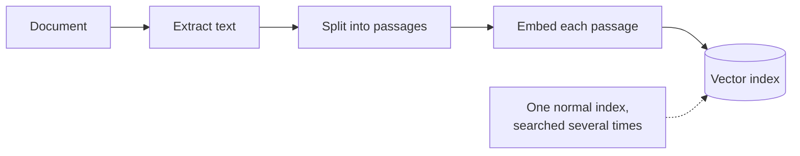
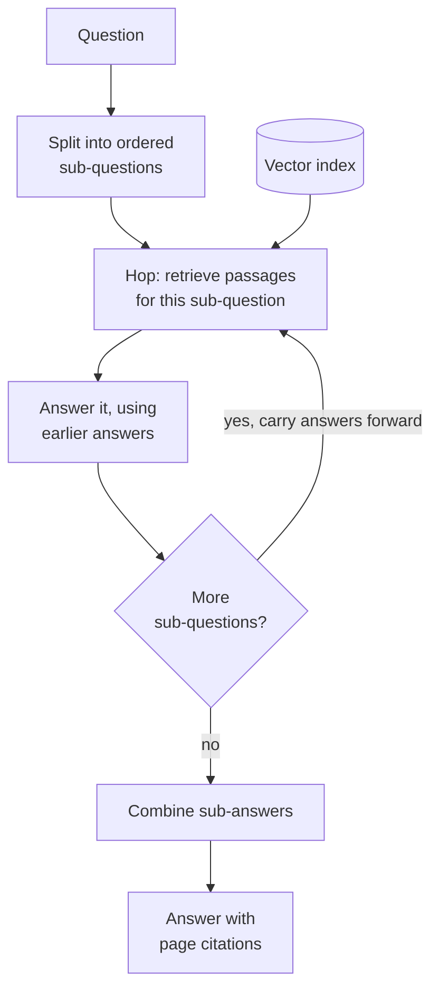

# Multi-hop RAG

## What it is

Some questions need facts from several places, like "which of the two suppliers has the longer contract?", and one search for the whole question rarely finds all of them. Multi-hop RAG splits the question into a chain of simple sub-questions, retrieves and answers each in turn, and feeds earlier answers into later ones (you can't ask for "Supplier B's term" until you know a supplier is called B). A final step combines the sub-answers. Each search uses a query that matches the text it is looking for, which a single search can't do.

## Ingestion flow

## Retrieval and generation flow

## Strengths

- **Answers what one search can't.** Comparisons, aggregations and chains where one fact depends on another.
- **Better queries.** A focused sub-question retrieves far better than a compound one.
- **Later hops are sharper.** Names and values found early make later queries precise.
- **Traceable.** A wrong answer can be traced to the hop that caused it.

## Limitations

- **Costly and slow.** Several model calls per question, run one after another because hops depend on each other.
- **Plan fixed up front.** The split is made before any evidence arrives, and nothing adds a step the plan missed.
- **Errors compound.** A wrong early answer is taken as fact by every later hop.
- **Bad splits.** Sub-questions that don't match how the document is organised retrieve nothing useful.
- **Overkill for simple questions.** It is often one route behind a router rather than the whole pipeline.

## Where to use it

- Comparison questions, where one search finds one side but not the other.
- Dependency chains: who holds a role, then what they decided, then when.
- Aggregation across a document that no single passage states.
- Not for simple lookups; pair with a router (see Adaptive RAG) if traffic is mixed.

## In this demo

- A LangGraph `StateGraph` with three node types:
  - `decompose`: one structured-output call producing an ordered list of sub-questions, capped by a sidebar maximum (fewer if not needed).
  - `hop`: once per sub-question, `$vectorSearch` on `rag_multi_hop`, then a generation call with all earlier sub-questions and answers in the prompt.
  - `combine`: writes the final answer from all hop answers, keeping page citations.
- The page shows each hop's sub-question, retrieved context and partial answer, plus the graph with this question's path outlined.
- Unlike Adaptive RAG's `multi_step` route, this demo always decomposes: the hop mechanism is the subject, not the decision to use it.
