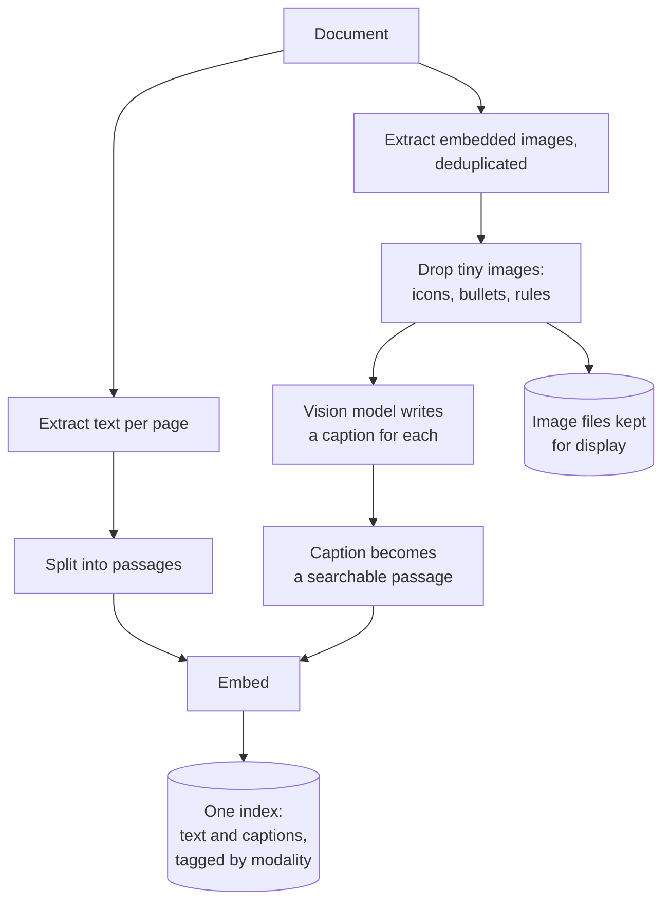
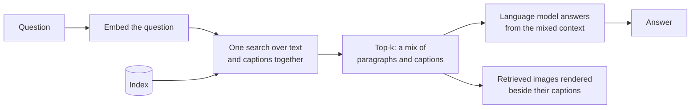

# Multimodal RAG

## What it is

A text pipeline reading a PDF sees a document with holes in it. Charts, diagrams, screenshots, scanned tables and photographs contribute nothing — not a weak signal, but no signal at all. The information is right there on the page, and retrieval is structurally blind to it. Ask about a trend that exists only as a line chart and the honest answer is that the document never mentioned it.

Multimodal RAG closes the gap by giving images a representation that retrieval can actually work with. The approach used here is **captioning at ingest**: extract each embedded image, send it to a vision-capable model, and have it describe what the image shows in text. That caption is embedded and indexed exactly like a paragraph. A chart becomes searchable prose about what the chart depicts, and from retrieval's point of view it is just another passage.

Because captions live in the same index as the text, one search covers both. A caption that matches the question competes directly with paragraphs and wins if it is the better match — which is right, since a figure answering the question is more relevant than a paragraph that nearly does. When an image is retrieved, the answer can cite it and the interface can show it alongside its caption.

The defining constraint is that **retrieval never sees the image again after ingest.** Everything downstream depends on the caption, so whatever the captioner failed to describe is permanently unfindable. If it wrote "a bar chart of quarterly revenue by region" and the question asks for the Q3 figure, the number was never written down and no search will surface it. Captions are lossy in a way text extraction is not: extracted text *is* the content, while a caption is one model's summary of it.

The alternative worth knowing about is a joint embedding model that maps images and text into one shared vector space, skipping captions entirely. That removes the lossy step but requires a different model, usually performs worse on dense charts and documents than a good caption does, and gives you nothing readable to show the user. Captioning trades some fidelity for the ability to reuse an ordinary text stack end to end.

## Ingestion flow

## Retrieval and generation flow

## Strengths

- **Information that was invisible becomes retrievable.** Figures, charts and diagrams enter the corpus instead of being silently dropped.
- **It reuses the entire text stack.** Same index, same search, same prompt assembly — captioning is the only new step, which makes this the cheapest possible way to add image support.
- **Text and images compete fairly.** One ranked list means the best match wins regardless of what it originally was.
- **Captions are human-readable**, so a user can see why an image was retrieved and judge whether the description is right — impossible with joint embeddings.
- **Answers can show their evidence.** Rendering the retrieved figure next to the answer is often more convincing than the prose.
- **Cost is bounded and one-off.** Captioning is paid once per image at ingest; questions cost exactly what text RAG costs.

## Limitations

- **The caption is the ceiling.** Retrieval matches on the description, so any detail it omits — usually the specific numbers — is permanently unfindable, even though a human looking at the image would answer instantly.
- **Captioners summarise rather than transcribe.** Dense charts and tables are where the loss is worst and where the answers people want most often live.
- **One vision call per image, and dense documents have many.** Slide decks and catalogues blow through any sensible cap, and uncaptioned images are simply absent from the index.
- **Vision capability gates on the provider.** A text-only model cannot do this at all, so the pipeline's image half silently disappears if no vision-capable provider is available.
- **Cost and token accounting for images are awkward.** Providers bill images by tiles or dimensions rather than characters, so estimates are rough.
- **Extraction misses things.** Vector graphics drawn directly on the page, images in unusual encodings, and figures composed of several separate objects may not be extracted as images at all.
- **Deciding what counts as content is heuristic.** Size thresholds filter icons and rules, but a small meaningful diagram gets filtered too.
- **Scanned pages are a different problem.** A full-page scan is not an embedded figure in a text document; it needs OCR or a document-understanding model, not a caption.

## Where to use it

- Documents where meaning genuinely lives in the figures: financial reports, scientific papers, technical manuals, architecture diagrams, slide decks exported to PDF.
- Product and support corpora full of annotated screenshots, where the answer is in the picture.
- As the pragmatic first step toward document understanding, before committing to a dedicated vision-language pipeline.
- Not where images are decorative — stock photography and branding are pure cost — and not as an OCR substitute for scanned documents.

## In this demo

PyMuPDF extracts text per page plus every embedded image via `page.get_images()`, deduplicated by xref so a logo repeated on every page is processed once, normalised to RGB PNG through a `Pixmap` (which also handles CMYK and indexed colour), and filtered by `MULTIMODAL_MIN_IMAGE_PX` to drop bullets, rules and icons. Up to `MULTIMODAL_MAX_IMAGES` images are captioned one at a time as a `HumanMessage` with a standard base64 `image` content block through `core.llm.get_chat_model()` — the same provider fallback chain every other LangChain demo uses, not a hardcoded vision model, so a provider that rejects image content simply fails over like a rate limit would. With this lab's defaults that means Gemini or OpenAI captions; Groq's `gpt-oss` models and the local Ollama model are text-only and fail over past. Text passages (`RecursiveCharacterTextSplitter`, ~800 chars) and captions go into one `rag_multimodal` collection via `MongoDBAtlasVectorSearch` tagged `modality=text` or `modality=image`; the caption is what gets embedded, while the PNG lives under `data/multimodal/<doc_id>/` and is looked up by path for rendering. One `$vectorSearch` filtered on `doc_id` alone retrieves both modalities into the same top-k, and an LCEL chain answers from the mix.

If no vision-capable provider is configured, every caption call fails over through the whole chain and comes back empty; images are dropped, the page reports how many and why, and the text side works as normal RAG. Token counts for vision calls are a flat estimate, not a measurement. Images PyMuPDF cannot decode as a pixmap (some `JPX`/`JBIG2` masks) are skipped during extraction.
