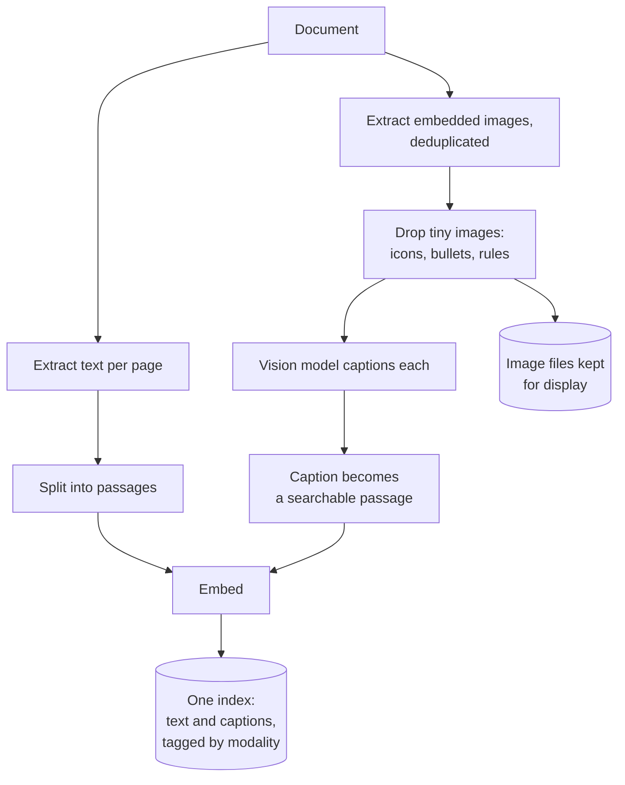
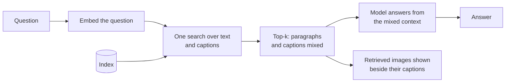

# Multimodal RAG

## What it is

Text-only RAG ignores charts, diagrams and screenshots, so anything shown only in a picture can never be found. Multimodal RAG fixes this by having a vision model write a text caption for each image at ingest, then indexing that caption next to the ordinary text. One search then covers both, and a retrieved image can be shown beside the answer. The catch: after ingest, retrieval only ever sees the caption, so whatever it left out is lost.

## Ingestion flow

## Retrieval and generation flow

## Strengths

- **Images become searchable.** Figures and charts enter the index instead of being silently dropped.
- **Reuses the text stack.** Same index, search and prompt; captioning is the only new step.
- **Fair competition.** Text and captions share one ranked list, so the best match wins.
- **Readable evidence.** Captions explain why an image was retrieved, and the image can be shown with the answer.
- **One-off cost.** Captioning is paid once at ingest; questions cost the same as text RAG.

## Limitations

- **The caption is the ceiling.** Details it omits, usually the exact numbers, can never be retrieved.
- **Captions summarise, not transcribe.** Dense charts and tables lose the most, and that is often where the answers are.
- **One vision call per image.** Image-heavy documents get expensive, and it needs a vision-capable model at all.
- **Extraction and filtering miss things.** Vector drawings or split figures may not extract as images, and size filters can drop small useful diagrams.
- **Not OCR.** Full-page scans need OCR or a document-understanding model, not captions.

## Where to use it

- Documents whose meaning lives in figures: reports, papers, manuals, slide decks.
- Support and product docs full of annotated screenshots.
- A cheap first step before a dedicated vision-language pipeline.
- Not for decorative images, and not as an OCR substitute for scans.

## In this demo

- **Extraction:** PyMuPDF reads text per page and images via `page.get_images()`, deduplicated by xref (a logo on every page is processed once), converted to RGB PNG through a `Pixmap` (handles CMYK and indexed colour), and filtered by `MULTIMODAL_MIN_IMAGE_PX`.
- **Captioning:** up to `MULTIMODAL_MAX_IMAGES` images, one at a time, as a `HumanMessage` with a base64 `image` content block through `core.llm.get_chat_model()`. That is the shared provider fallback chain, not a hardcoded vision model: a provider that rejects images fails over like a rate limit. With the defaults, Gemini or OpenAI caption; Groq's `gpt-oss` models and the local Ollama model are text-only and get skipped.
- **Indexing:** text passages (`RecursiveCharacterTextSplitter`, ~800 chars) and captions go into one `rag_multimodal` collection via `MongoDBAtlasVectorSearch`, tagged `modality=text` or `modality=image`. The caption is embedded; the PNG is stored under `data/multimodal/<doc_id>/` for display.
- **Retrieval:** one `$vectorSearch` filtered on `doc_id` returns both modalities in one top-k; an LCEL chain answers.
- **No vision provider:** caption calls fail through the whole chain, images are dropped, the page says how many and why, and the text side works as normal RAG.
- **Caveats:** vision-call token counts are a flat estimate. Images PyMuPDF can't decode as a pixmap (some `JPX`/`JBIG2` masks) are skipped.
