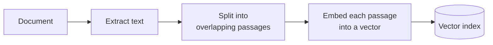
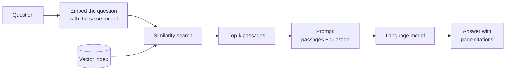

# Naive RAG

## What it is

The baseline retrieval-augmented generation pipeline — the one every other technique on this app is a modification of.

A language model can only answer from what is in its prompt. Naive RAG is the simplest way to decide what goes in there: cut the document into passages ahead of time, turn each passage into a vector that encodes its meaning, and at question time fetch the handful of passages whose vectors sit closest to the question's vector. Those passages are pasted into the prompt, and the model answers from them.

The whole technique rests on one assumption: **a passage that means something similar to the question probably contains its answer.** That assumption is right often enough to be useful and wrong often enough that the other fifteen demos exist.

Two things are worth noticing. The passages are embedded once, at ingest time, without ever seeing a question — so retrieval is a cheap vector lookup rather than a pass over the document. And nothing in the pipeline ever checks its own work: whatever comes back from the search goes into the prompt, and the model answers as if it were relevant.

## Ingestion flow

## Retrieval and generation flow

## Strengths

- **Simple enough to reason about.** Four moving parts, one model call per question, no branching. When an answer is wrong you can usually tell which stage caused it.
- **Cheap and fast at question time.** Retrieval is a vector lookup, not a pass over the document, so cost barely grows as the collection grows.
- **Understands paraphrase.** Because it matches on meaning rather than words, a question can use entirely different vocabulary from the passage that answers it.
- **The honest reference point.** Every fancier technique costs more latency, money or complexity. Measuring against this baseline is how you find out whether that cost bought anything.

## Limitations

- **Semantic similarity is not relevance.** The search has no notion of exact terms, so a question naming a specific code, ID or date can rank a vaguely related paragraph above the literal match. Hybrid search exists for this.
- **Fixed-size splitting cuts through meaning.** A sentence, table or definition split across two passages is weakened in both. Chunking strategies explores this.
- **Ranking is never revisited.** The order comes straight out of the vector comparison, which scores the question and the passage independently and never reads them together. Re-ranking exists for this.
- **Passages lose their context.** "Revenue grew 3%" retrieved alone doesn't say whose revenue, or when. Contextual retrieval exists for this.
- **One pass, so one hop.** A question whose answer requires joining two distant facts typically surfaces only one of them. Multi-hop RAG exists for this.
- **No self-checking.** If retrieval returns nothing useful, the model is still asked to answer, and it usually will. CRAG and Self-RAG exist for this.

## Where to use it

- As the control case when evaluating any other technique — build this first, measure it, and only add machinery that beats it.
- Small, single-topic document sets where questions are broad and phrased in the document's own terms.
- Prototypes and internal tools where a good-enough answer with a citation is worth far more than the engineering budget a tuned pipeline would need.
- Teaching and debugging: because there is nowhere for a failure to hide, it is the best pipeline to learn on.

## In this demo

Text is extracted with PyMuPDF's text layer, split by a hand-written recursive splitter (paragraph → sentence → word → character, targeting `NAIVE_CHUNK_SIZE` with `NAIVE_CHUNK_OVERLAP`), embedded locally with `BAAI/bge-small-en-v1.5`, and stored in MongoDB (`rag_naive`) filtered by `doc_id`. Questions run `$vectorSearch` for the top-k passages and one chat-model call. No LangChain — every step is written out so the mechanics stay visible.
