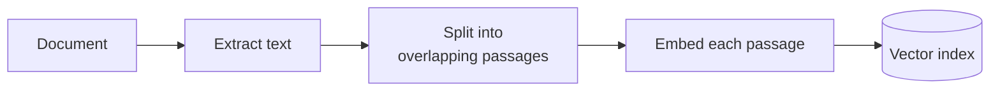
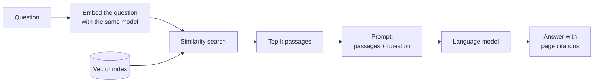

# Naive RAG

## What it is

A language model can only answer from what is in its prompt, so RAG (retrieval-augmented generation) finds the right text and puts it there. Naive RAG is the simplest version: split the document into passages, turn each one into an embedding (a vector of numbers that captures its meaning), and at question time fetch the few passages whose vectors are closest to the question's. The model then answers from those passages. Every other technique in this app is a change to this baseline.

## Ingestion flow

## Retrieval and generation flow

## Strengths

- **Simple.** Few moving parts and one model call, so a wrong answer is easy to trace to a stage.
- **Cheap at question time.** Retrieval is a vector lookup, so cost barely grows with the collection.
- **Handles paraphrase.** It matches on meaning, so the question can use different words from the passage.
- **A fair baseline.** Measuring against it shows whether a fancier technique is worth its cost.

## Limitations

- **Similar is not the same as relevant.** Exact codes, IDs or dates can lose to a vaguely related paragraph. Hybrid search exists for this.
- **Fixed-size splits cut through meaning.** A sentence or table split in two is weaker in both halves. Chunking strategies explores this.
- **Rough ranking.** Question and passage are never read together, so the order is approximate. Re-ranking exists for this.
- **Passages lose context.** "Revenue grew 3%" alone doesn't say whose or when. Contextual retrieval exists for this.
- **No self-checking or second hop.** Bad results still get answered, and facts spread across the document are missed. CRAG, Self-RAG and multi-hop RAG exist for this.

## Where to use it

- As the control case when evaluating any other technique.
- Small, single-topic document sets with broad questions.
- Prototypes and internal tools where a good-enough cited answer is enough.
- Learning and debugging, since failures have nowhere to hide.

## In this demo

- Text: PyMuPDF text layer.
- Splitting: hand-written recursive splitter (paragraph → sentence → word → character), sized by `NAIVE_CHUNK_SIZE` and `NAIVE_CHUNK_OVERLAP`.
- Embeddings: `BAAI/bge-small-en-v1.5`, run locally.
- Storage: MongoDB collection `rag_naive`, filtered by `doc_id`; retrieval via `$vectorSearch` for the top-k.
- One chat-model call per question.
- No LangChain: every step is written out so the mechanics stay visible.
