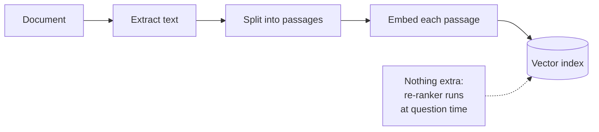
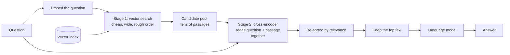

# Re-ranking

## What it is

Re-ranking retrieves in two stages. First a fast vector search pulls a wide pool of candidates (say 50), embedding question and passages separately, so the order is rough. Then a slower cross-encoder, a model that reads the question and each passage together, scores every pair and re-sorts them, and only the top few go to the prompt. You get accurate ordering while running the expensive model on 50 passages, not the whole collection.

## Ingestion flow

## Retrieval and generation flow

## Strengths

- **Rescues buried answers.** It fixes the most common retrieval failure: the right passage was found but ranked too low.
- **Better passages in the prompt.** Fewer, more relevant passages cut tokens and distractions.
- **Works on top of anything.** It adds to vector, keyword or hybrid search without changing them.
- **One clear dial.** Pool size trades latency against recall.

## Limitations

- **It cannot retrieve.** If the right passage isn't in the pool, re-ranking can't find it.
- **Slower per question.** Nothing can be precomputed, so a bigger pool means a slower answer.
- **A second model to host**, with its own memory and CPU/GPU cost.
- **Relevant is not sufficient.** A top-ranked passage may still not contain the answer.
- **Domain drift.** A general re-ranker can misjudge specialised text unlike its training data.

## Where to use it

- The right answer is retrieved but ranked too low to reach the prompt.
- Large or dense collections with many similar-looking passages.
- Quality-sensitive tools that can spend a few hundred milliseconds per question.
- Inside agentic, corrective or multi-hop pipelines, to tighten each retrieval.

## In this demo

- Stage 1: `MongoDBAtlasVectorSearch.similarity_search_with_score()` over `rag_rerank`, pulling `candidate_k` passages (default 20) and keeping each raw score for comparison.
- Stage 2: `cross-encoder/ms-marco-MiniLM-L-6-v2` via sentence-transformers' `CrossEncoder`, local on CPU.
- The top `top_k` (default 5) go into an LCEL chain (`prompt | chat model | parser`).
- Pool size and final count are sidebar sliders; keep the pool well above the final count or there's little to reorder.
- The page shows each kept passage's rank and score before and after, so a move like 9 → 1 is visible.
- Re-ranking is local and never rate-limited, so the ranking table renders even if the answer call fails.
