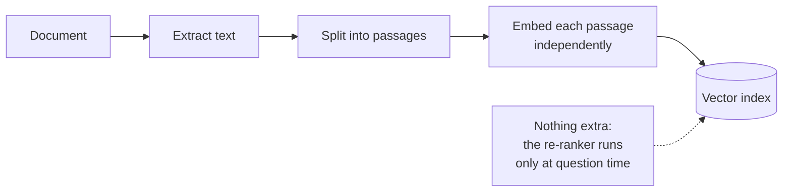
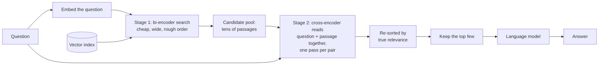

# Re-ranking

## What it is

Re-ranking splits retrieval into two stages with different economics: a fast, approximate search to narrow the field, then a slow, accurate model to order what survived.

The reason the split is necessary is structural. Ordinary vector search uses a **bi-encoder**: the question and each passage are turned into vectors *independently*, and relevance is how close those two vectors land. Because passages are embedded ahead of time and never re-read, searching a million of them costs one question embedding plus a nearest-neighbour lookup. That is what makes retrieval cheap — and it is also the limitation, because the model encoding a passage has no idea what will eventually be asked of it. It must compress the passage into one vector that is equally ready for every possible question.

A **cross-encoder** does the thing a bi-encoder structurally cannot: it takes the question and one passage *together* as a single input and attends across both, so it can judge whether this specific passage answers this specific question. That is far more accurate. It is also far more expensive — there is nothing to precompute, so cost is one model pass per passage considered, which is hopeless across a whole collection.

Re-ranking uses each where it is strong. The bi-encoder retrieves a wide candidate pool — say fifty passages instead of five — cheaply and with high recall, accepting that the ordering is rough. The cross-encoder then scores those fifty pairs properly and re-sorts them, and only the top few reach the prompt. The expensive model runs fifty times instead of a million, which is affordable, and the passages that reach the model are ordered by something much closer to real relevance.

The characteristic win is a passage that first-stage search ranked ninth — inside the pool, but far outside the prompt — turning out to be the best answer and moving to first.

## Ingestion flow

## Retrieval and generation flow

## Strengths

- **It recovers answers that were already retrieved but buried.** The most common retrieval failure is not absence but bad ordering, and this fixes exactly that.
- **Accuracy where it is affordable.** Reading the question and passage jointly is the single biggest quality gain available in retrieval, and staging makes it cheap enough to use.
- **Fewer, better passages in the prompt.** A tighter, more relevant context reduces both token cost and the model's opportunity to latch onto an irrelevant passage.
- **It composes with everything.** Re-ranking sits on top of vector, keyword or hybrid retrieval without changing any of them, which is why it appears inside so many larger pipelines.
- **Tunable in one number.** The candidate pool size trades latency against recall directly and legibly.

## Limitations

- **It cannot retrieve.** The re-ranker only reorders what stage one found — if the right passage never entered the candidate pool, no amount of re-ranking will surface it. Recall is still the first stage's problem.
- **Latency scales with the pool, and it is per-question work.** Nothing here can be precomputed, so a larger pool is directly a slower answer.
- **A second model to run and host**, with its own memory and CPU or GPU footprint alongside the embedding model.
- **A pool barely larger than the final selection wastes the stage.** If you retrieve six candidates and keep five, there is almost nothing to reorder.
- **Relevance is not sufficiency.** The re-ranker ranks passages against the question; it does not check whether the winning passage actually contains an answer, so a confidently top-ranked but unhelpful passage still reaches the prompt.
- **Cross-encoders inherit their training domain.** A general-purpose re-ranker can misjudge specialised material whose notion of relevance differs from the web text it was trained on.

## Where to use it

- Any pipeline where the right answer is demonstrably being retrieved but ranked too low to reach the prompt — check this before adding anything more elaborate.
- Large or topically dense collections, where many passages are superficially similar and first-stage ordering is close to arbitrary among them.
- Quality-sensitive applications that can spend a few hundred milliseconds per question: support, research, legal and internal knowledge tools.
- As a component inside agentic, corrective or multi-hop pipelines, tightening each retrieval pass rather than acting as the technique on its own.

## In this demo

Stage one is `MongoDBAtlasVectorSearch.similarity_search_with_score()` over `rag_rerank`, pulling `candidate_k` passages (default 20) and keeping each raw vector score for the before/after comparison. Stage two is `cross-encoder/ms-marco-MiniLM-L-6-v2` via sentence-transformers' `CrossEncoder`, run locally on CPU, scoring every question/passage pair and re-sorting; the top `top_k` (default 5) go into an LCEL chain (`prompt | chat model | parser`). Both pool size and final count are sidebar sliders, and the page shows each kept passage's rank and score before and after, so a move like rank 9 to rank 1 is visible directly. The re-ranking pass is local and never rate-limited, so the ranking table still renders even if the answer call fails.
