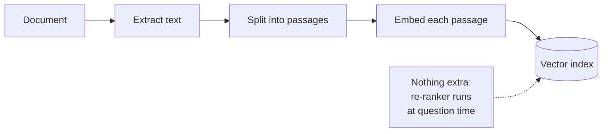
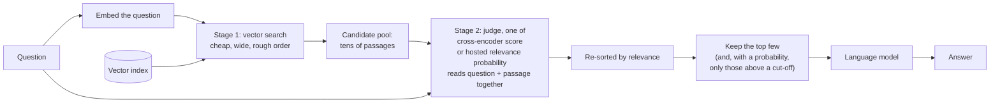

# Re-ranking

## What it is

Re-ranking retrieves in two stages. First a fast vector search pulls a wide pool of candidates (say 50), embedding question and passages separately, so the order is rough. Then a slower judge that reads the question and each passage together scores every pair and re-sorts them, and only the top few go to the prompt. You get accurate ordering while running the expensive model on 50 passages, not the whole collection.

Two kinds of judge are common. A cross-encoder is a small model that outputs a relevance score, usable for ordering but with no fixed scale. A hosted judge model can answer "does this passage help answer the question?" and return a calibrated probability, which also lets you drop passages below a cut-off instead of always keeping a fixed number.

## Ingestion flow

```mermaid
flowchart LR
  A["Document"] --> B["Extract text"]
  B --> C["Split into passages"]
  C --> D["Embed each passage"]
  D --> E[("Vector index")]
  N["Nothing extra:<br/>re-ranker runs<br/>at question time"] -.-> E
```

## Retrieval and generation flow

```mermaid
flowchart LR
  Q["Question"] --> E["Embed the question"]
  E --> S["Stage 1: vector search<br/>cheap, wide, rough order"]
  I[("Vector index")] --> S
  S --> P["Candidate pool:<br/>tens of passages"]
  P --> X["Stage 2: judge, one of<br/>cross-encoder score<br/>or hosted relevance probability<br/>reads question + passage together"]
  Q --> X
  X --> R["Re-sorted by relevance"]
  R --> T["Keep the top few<br/>(and, with a probability,<br/>only those above a cut-off)"]
  T --> L["Language model"]
  L --> A["Answer"]
```

## Strengths

- **Rescues buried answers.** It fixes the most common retrieval failure: the right passage was found but ranked too low.
- **Better passages in the prompt.** Fewer, more relevant passages cut tokens and distractions.
- **Works on top of anything.** It adds to vector, keyword or hybrid search without changing them.
- **One clear dial.** Pool size trades latency against recall.
- **A probability can be thresholded.** A calibrated relevance probability lets you drop weak passages (or skip the answer call when none qualify), which a raw cross-encoder score can't do.

## Limitations

- **It cannot retrieve.** If the right passage isn't in the pool, re-ranking can't find it.
- **Slower per question.** Nothing can be precomputed, so a bigger pool means a slower answer.
- **A second model to host or pay for.** A local cross-encoder costs memory and CPU/GPU; a hosted judge costs per token, adds a network round trip and can be rate-limited or unavailable.
- **Relevant is not sufficient.** A top-ranked passage may still not contain the answer.
- **Domain drift.** A general re-ranker can misjudge specialised text unlike its training data.

## Where to use it

- The right answer is retrieved but ranked too low to reach the prompt.
- Large or dense collections with many similar-looking passages.
- Quality-sensitive tools that can spend a few hundred milliseconds per question.
- Inside agentic, corrective or multi-hop pipelines, to tighten each retrieval.

## In this demo

- Stage 1: `MongoDBAtlasVectorSearch.similarity_search_with_score()` over `rag_rerank`, pulling `candidate_k` passages (default 20) and keeping each raw score for comparison.
- Stage 2 is a sidebar toggle:
  - **Cross-encoder** (default): `cross-encoder/ms-marco-MiniLM-L-6-v2` via sentence-transformers' `CrossEncoder`, local on CPU.
  - **Jev**: TypeSafe's `jev-1.13.0` through `langchain-typesafe`'s `TypeSafeClassifier`, one yes/no request per candidate ("does the passage help answer the question?"), run in parallel with `.batch()` and retried on rate limits with `.with_retry()`. Needs `TYPESAFE_API_KEY`; without it the toggle explains what to set and the cross-encoder still works. The model is pinned (`TYPESAFE_MODEL`), not `jev-latest`, so probabilities don't shift on a release; the trace shows the model ID Jev reports.
- The top `top_k` (default 5) go into an LCEL chain (`prompt | chat model | parser`).
- Pool size and final count are sidebar sliders; keep the pool well above the final count or there's little to reorder.
- With Jev, a "Min Jev probability" slider drops passages below the cut-off before the top `top_k` is taken; if none qualify the chat model isn't called.
- The page shows each kept passage's rank and score before and after, so a move like 9 → 1 is visible. Jev's input tokens and approximate cost appear in the trace.
- With Langfuse configured, each Jev call is an observation inside the `rerank_ask` trace, and the probabilities are pushed as scores: `jev_relevance` per candidate, plus `jev_top1_relevance` and `jev_mean_kept_relevance` per question.
- The cross-encoder is local and never rate-limited. Jev is a network call: if it fails, the page says so and offers the cross-encoder instead of falling back silently.
