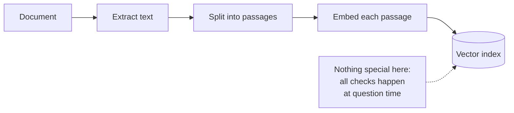
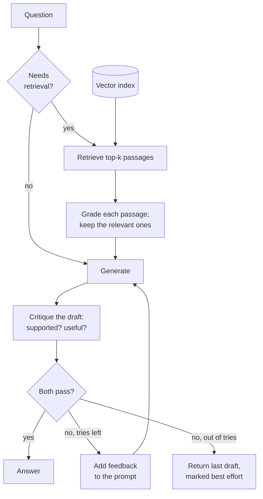

# Self-RAG

## What it is

Self-RAG has the model check its own work. First it decides whether a question needs retrieval at all. Then it throws away retrieved passages that aren't relevant, and grades its draft answer on two things: is every claim backed by the passages (*supported*), and does it actually answer the question (*useful*)? If either check fails, it rewrites the draft using that feedback, for a limited number of tries.

## Ingestion flow

## Retrieval and generation flow

## Strengths

- **Catches hallucination directly.** The supported check flags claims the passages don't back.
- **Separates two failures.** An answer can be grounded but off-topic, or on-topic but unsupported; each gets its own check.
- **Retries can fix the problem.** Specific feedback is often enough for a better second draft.
- **Skips pointless retrieval.** Small talk and general questions don't pull irrelevant passages into the prompt.
- **Leaves an audit trail.** Every grade and piece of feedback can be inspected afterwards.

## Limitations

- **Many model calls.** At least three per answer, plus two per retry.
- **The critic shares the generator's blind spots.** A confident misunderstanding usually passes its own review.
- **Retries can't add missing facts.** If the passages lack the answer, rewriting just burns the retry budget.
- **A wrong "no retrieval" call can't be undone.** The answer is generated and critiqued with no context at all.
- **Unpredictable latency.** A question that retries takes about twice as long, and a failed best-effort draft still ships.

## Where to use it

- High-stakes answers (medical, legal, financial) where an unsupported claim is the main risk.
- Places where answers must be defensible later.
- Chat that mixes small talk with document questions.
- Not where latency is tight or retrieval itself is broken.

## In this demo

- A LangGraph `StateGraph` with a retry loop. Collection: `rag_self_rag`.
- Nodes:
  - `route` decides whether retrieval is needed.
  - `retrieve` runs `$vectorSearch`.
  - `filter_relevant` grades each passage relevant/irrelevant with structured output and keeps the survivors.
  - `generate` drafts from what's left, or from nothing if retrieval was skipped or nothing survived.
  - `critique` grades **supported** (`fully_supported` / `partially_supported` / `not_supported`) and **useful**, plus one sentence of feedback.
- A failed draft regenerates with the feedback, up to `max_retries` extra attempts. After that the last draft is returned with a best-effort warning.
- The page shows the routing decision and reason, each generate/critique attempt with its grades, and the graph with this question's path outlined. A longer path means at least one retry.
