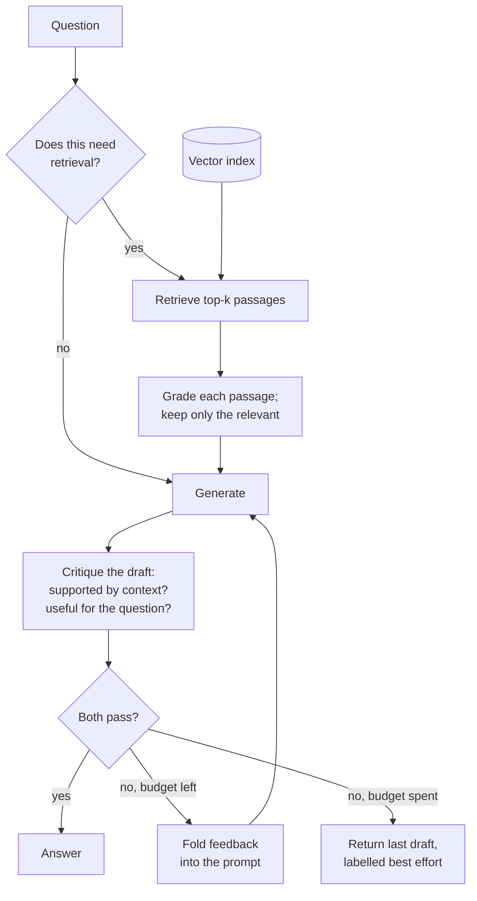

# Self-RAG

## What it is

CRAG checks the sources. Self-RAG checks the answer.

An ordinary pipeline produces a draft and ships it. Nothing asks whether the claims in that draft are actually backed by the retrieved passages, or whether the draft addresses what was asked. Self-RAG makes both of those explicit steps and adds a third question at the front that most pipelines never ask: **does this even need retrieval?**

So the technique is really three judgements wrapped around generation:

**Should I retrieve?** Not every input needs the document. Greetings, follow-ups already answered, and general knowledge don't, and retrieving anyway wastes a search and stuffs the prompt with irrelevant passages that can actively mislead. A routing decision up front skips retrieval for those.

**Is each retrieved passage relevant?** Retrieval returns a fixed number of results whether or not that many are useful. Filtering them individually means the prompt gets only what survived, rather than the top-k by construction.

**Is the draft supported, and is it useful?** These are separate failures and need separate checks. *Supported* asks whether every claim traces back to the context — this is the hallucination check, and it can fail even when the answer is correct, because an answer the model knew from training but the context does not contain is still unsupported. *Useful* asks whether the draft actually addresses the question — an answer can be perfectly grounded and still not respond to what was asked.

When either check fails, the critique becomes feedback and generation runs again with it. That retry loop is what makes this self-correcting rather than merely self-reporting, and it needs a hard budget: a model that cannot fix a problem will not fix it on the fifth attempt either, so after a bounded number of tries the last draft is returned and labelled a best effort rather than a verified answer.

The honest caveat is that the critic is the same kind of model as the generator, with the same blind spots. Grading your own work catches sloppiness reliably and catches confident misunderstanding much less reliably.

## Ingestion flow

## Retrieval and generation flow

## Strengths

- **It targets hallucination directly.** The supported check exists specifically to catch the model asserting what the context does not back, which is the failure users are least equipped to notice.
- **Two distinct failures, two distinct checks.** Grounded-but-irrelevant and relevant-but-unsupported are different bugs, and separating them makes each diagnosable.
- **The retry loop can actually fix things.** Specific feedback — a claim with no support, a sub-question left unanswered — is often enough for a second draft to succeed.
- **Retrieval is skipped when pointless**, saving a search and keeping irrelevant passages out of the prompt.
- **Filtering tightens the context**, so generation sees fewer, better passages.
- **The critique is an audit trail.** Every attempt, grade and piece of feedback is inspectable, which is valuable wherever answers must be defensible.

## Limitations

- **At least three model calls per answer**, and two more per retry — the budget bounds the worst case, not the typical one.
- **The critic shares the generator's blind spots.** A misunderstanding confident enough to produce a bad answer is usually confident enough to pass its own review.
- **Retries can loop on an unfixable problem.** When the real issue is that the context lacks the answer, no rewrite helps, and the budget is spent discovering that.
- **The router is a single point of failure with no recovery.** Wrongly skipping retrieval means generation and critique both proceed with no context, and nothing downstream brings retrieval back for that turn.
- **Over-strict critique wastes budget** rejecting acceptable answers; over-lenient critique rubber-stamps bad ones. The threshold is a judgement call baked into a prompt.
- **Latency is variable**, because a question that retries takes twice as long as one that doesn't — awkward for streaming interfaces, since a draft may be discarded after it would have started rendering.
- **A best-effort answer still ships.** When the budget runs out the user gets an answer that failed its own checks, and the labelling is what protects them.

## Where to use it

- High-stakes answering — medical, legal, financial, compliance — where an unsupported claim is the failure that matters most.
- Anywhere answers must be defensible after the fact, since the critique record shows what was checked.
- Mixed conversational workloads combining small talk with document questions, where routing avoids pointless retrieval.
- Systems with weak or noisy retrieval, where filtering and critique compensate for context quality you cannot improve directly.
- Not where latency is tight or volume is high, and not as a substitute for retrieval that actually works — self-critique cannot invent an answer the corpus never had.

## In this demo

A LangGraph `StateGraph` with a retry loop. `route` decides whether the question needs retrieval at all; `retrieve` runs `$vectorSearch` against `rag_self_rag`; `filter_relevant` grades each passage relevant or irrelevant via structured output and keeps only the survivors; `generate` drafts an answer from what remains (or from nothing, if retrieval was skipped or nothing survived); `critique` grades the draft on **supported** (`fully_supported` / `partially_supported` / `not_supported`) and **useful**, plus one sentence of feedback. A draft failing either check regenerates with that feedback folded in, up to `max_retries` extra attempts, after which the last draft is returned with a warning that it is a best effort. The page shows the routing decision and its reason, every generate/critique attempt with its grades, and the graph with this question's path outlined — a longer path means at least one retry happened.
