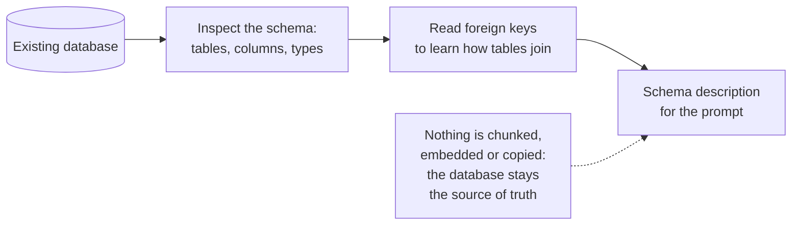
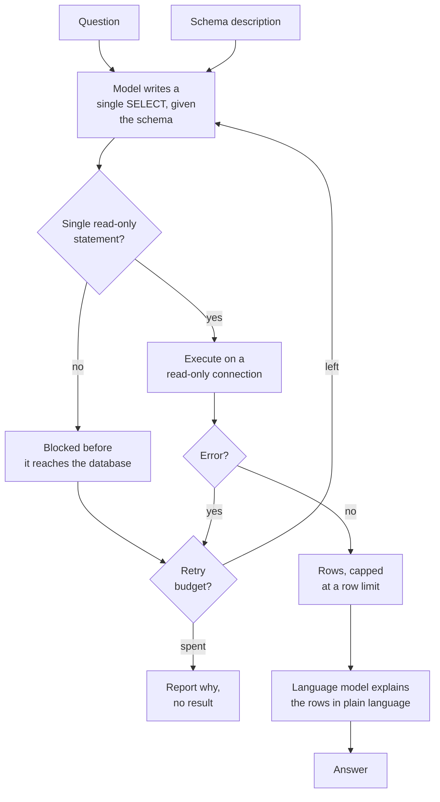

# SQL RAG

## What it is

Every other technique here retrieves passages. This one retrieves **rows**, and the difference runs deeper than the data type.

Some questions are simply not answerable from text, no matter how good retrieval is. *"Which five artists generated the most revenue last quarter?"* The answer is written down nowhere. It has to be *computed* — joined across tables, summed, sorted, truncated. If you flattened those tables into sentences and embedded them, you would destroy the structure that makes the question answerable and gain nothing, because no passage would contain the answer either.

The insight is that the database already has an exact, efficient query engine. What it lacks is the ability to understand a question in English. So instead of retrieving text, the model is shown the **schema** — tables, columns, types, and the foreign keys that say how they join — and asked to write a query. The query runs, and the rows come back as the context the model answers from.

This inverts RAG's usual trust model, and that is the most important thing about it. Ordinary retrieval is read-only by construction: the worst a bad vector search can do is return an unhelpful paragraph. Here the model emits **executable code against your database**, so a generated statement is untrusted input, and the safety story cannot be a prompt asking it nicely to only read. It has to be enforced outside the model: reject anything that isn't a single read statement before execution, and connect with a read-only account so that even a statement slipping through the check is refused by the database. Two independent layers, because either one alone is a single point of failure.

There is also a subtler limitation. The model sees the schema but not the data, so it knows a column is called `Country` and not whether it holds `"USA"` or `"United States"`. Syntactically perfect queries routinely return nothing for this reason, and a query joining on a plausible but wrong column returns a confident, precise, wrong number — with no relevance score to cast doubt on it.

## Ingestion flow

## Retrieval and generation flow

## Strengths

- **Exact answers to computational questions.** Counts, sums, rankings, averages and joins are arithmetic, not approximation — there is no top-k and no relevance threshold.
- **Structure is preserved rather than destroyed.** Relationships between tables stay queryable instead of being flattened into prose.
- **No ingest, no index, no staleness.** Queries hit live data, so there is nothing to re-embed when a row changes — a significant operational advantage over every other technique here.
- **It scales to data volumes text retrieval cannot touch.** Aggregating millions of rows is routine for a database and impossible for a context window.
- **Maximum auditability.** The query is the explanation: anyone who reads SQL can verify exactly how the answer was produced and re-run it.
- **It composes.** Most real systems need both this and passage retrieval, routed per question.

## Limitations

- **Generated code is untrusted input.** This is the only technique here where a bad model output could modify data, and safety must be enforced in code and in database permissions, never by prompt alone.
- **Wrong queries look exactly like right ones.** A join on the wrong column returns a precise number with no uncertainty signal — the most dangerous failure mode in this app.
- **The model sees the schema, not the values.** It cannot know the encoding, spelling or units a column actually uses, so correct-looking queries return nothing.
- **Schema quality is the ceiling.** Cryptic table names, missing foreign keys and undocumented conventions degrade accuracy sharply; a well-named schema is the highest-leverage fix available.
- **Ambiguous questions get silently narrowed.** "Who is the best artist?" produces a query answering one reasonable interpretation, with no clarification step.
- **Complex joins are where it breaks.** Answers needing four-table traversals are exactly where models quietly produce a narrower query than asked.
- **Statement-shape allow-listing is not full parsing** — good enough for a read-only demo database, not a substitute for a real query sandbox with timeouts, row limits and resource controls.
- **Large result sets don't fit.** Rows must be capped, and a question whose answer is ten thousand rows needs aggregation the model may not have applied.

## Where to use it

- Business intelligence and analytics questions over relational data: metrics, rankings, trends, counts.
- Operational lookups against live systems — orders, inventory, tickets, accounts — where freshness matters more than nuance.
- Any question involving aggregation or joins, which passage retrieval cannot do at all.
- As one route inside a larger router, alongside document retrieval, so structured questions go to SQL and narrative ones go to text.
- Not for questions about meaning, explanation or nuance, which live in documents rather than tables — and not against a production database without a read-only account, a query sandbox and real resource limits.

## In this demo

There is no upload: the PDF-only rule doesn't fit a database, so this queries a bundled read-only copy of the Chinook sample database (`samples/chinook.db` — a record-store schema of artists, albums, tracks, invoices, customers and employees). Nothing is stored per question either, so there is no "Clear my data" button. The schema is read with the SQLAlchemy inspector and shown on the page; the chat model writes one `SELECT` via structured output; the statement is then checked in code — single statement, starts with `SELECT` or `WITH`, no write or schema keyword (`INSERT`, `UPDATE`, `DELETE`, `DROP`, `ALTER`, `CREATE`, …) — and executed through SQLAlchemy on a connection opened read-only with SQLite's `mode=ro`, capped at a row limit. A rejected or failing query goes back to the model once for a fix-and-retry; if that fails too, the page shows why instead of a result.

Asking it to delete or alter something is worth doing deliberately: the model may well draft the statement, and watching the app-level check block it — with SQLite's read-only mode behind that as a second layer — is the point of the demo.
