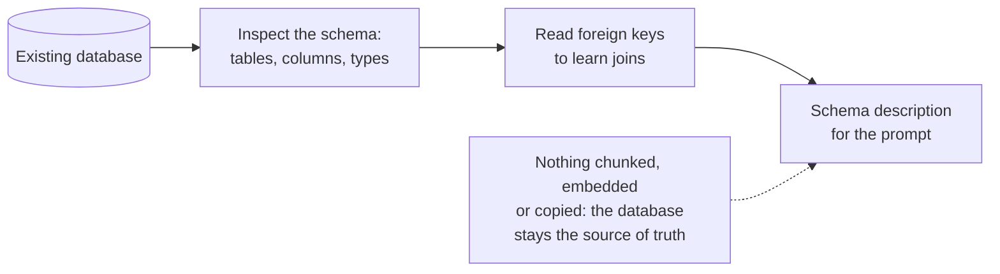
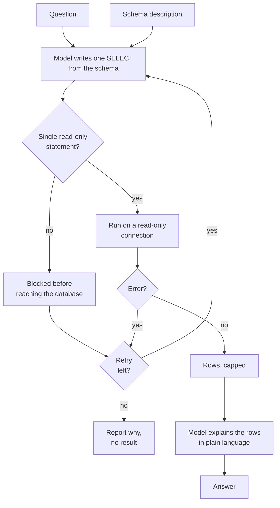

# SQL RAG

## What it is

Some questions ("top five artists by revenue last quarter") aren't written in any document; they have to be computed from tables. SQL RAG shows the model the database schema (tables, columns, how they join), has it write a SQL query, runs it, and answers from the returned rows. Because the model is now writing code that runs on your database, safety must be enforced outside the model: only allow read statements, and connect with a read-only account.

## Ingestion flow

## Retrieval and generation flow

## Strengths

- **Exact computed answers.** Counts, sums, rankings and joins are arithmetic, not approximation.
- **No index to maintain.** Queries hit live data, so nothing needs re-embedding when rows change.
- **Scales to big data.** Aggregating millions of rows is routine for a database and impossible for a prompt.
- **Auditable.** The query itself explains the answer and can be re-run.
- **Combines well.** Pairs with passage retrieval behind a router for mixed question types.

## Limitations

- **Generated code is untrusted.** A bad output could change data, so safety must live in code and database permissions, not the prompt. Simple statement checks are no substitute for a real sandbox with timeouts and resource limits.
- **Wrong queries look right.** A join on the wrong column returns a precise, wrong number with no uncertainty signal.
- **Schema, not values.** The model can't know whether `Country` holds "USA" or "United States", so valid queries often return nothing.
- **Schema quality is the ceiling.** Cryptic names and missing foreign keys hurt accuracy sharply; complex joins and ambiguous questions get quietly narrowed.
- **Big results don't fit.** Rows must be capped, so questions need aggregation the model may not apply.

## Where to use it

- Analytics over relational data: metrics, rankings, trends, counts.
- Live operational lookups: orders, inventory, tickets, accounts.
- One route in a router, with document retrieval handling narrative questions.
- Not for questions of meaning or nuance, and never on production without a read-only account and a sandbox.

## In this demo

- **Data:** no upload (PDF-only doesn't fit a database). It queries a bundled read-only Chinook sample database, `samples/chinook.db`: artists, albums, tracks, invoices, customers, employees. Nothing is stored per question, so there is no "Clear my data" button.
- **Schema:** read with the SQLAlchemy inspector and shown on the page.
- **Query:** the chat model writes one `SELECT` via structured output.
- **Check in code:** single statement, starts with `SELECT` or `WITH`, no write or schema keyword (`INSERT`, `UPDATE`, `DELETE`, `DROP`, `ALTER`, `CREATE`, …).
- **Execution:** through SQLAlchemy on a connection opened with SQLite's `mode=ro`, capped at a row limit.
- **Retry:** a rejected or failing query goes back to the model once; if that fails, the page shows why.
- **Try it:** ask it to delete or alter something. The model may draft it; the app check blocks it, with SQLite's read-only mode as a second layer.
