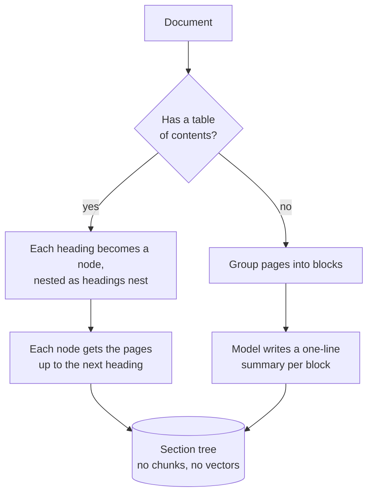
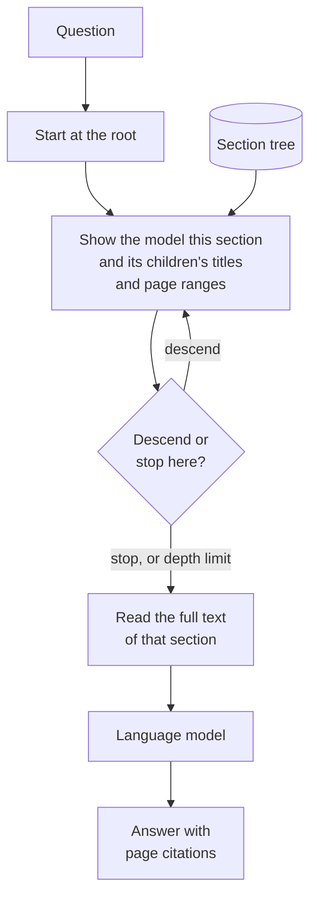

# Vectorless RAG

## What it is

Vectorless RAG finds information the way a person does: open the table of contents, pick the section that sounds right, and read it. At ingest the document's headings become a tree, with no chunking and no embeddings. At question time a model walks the tree, choosing at each level which child section would contain the answer, then reads that whole section and answers from it. It picks by reasoning about relevance rather than by text similarity, and sections arrive whole instead of cut into fragments.

## Ingestion flow

## Retrieval and generation flow

## Strengths

- **Relevance, not resemblance.** The model picks the section that would contain the answer, which beats similarity when the right section doesn't sound like the question.
- **No chunking failures.** Tables, lists and definitions arrive whole.
- **Readable trace.** A path of section titles is an explanation anyone can check.
- **Nothing to maintain.** No vector store, no index, no re-embedding.

## Limitations

- **Slow.** Each level is a sequential model call before answering starts.
- **No backtracking.** One wrong choice near the root makes the right section unreachable, and an answer spread over two sections gets only one.
- **Only as good as the structure.** Generic headings or no table of contents leave little to navigate.
- **Sections can be too long.** A big section may not fit in the prompt and gets truncated.
- **No scores, no scale.** One section comes back with no relevance signal, and navigating thousands of documents needs an index.

## Where to use it

- Long, well-structured documents with meaningful headings: specs, manuals, filings, contracts, annual reports.
- Questions where the right section doesn't sound like the question.
- Retrieval that must be explained to non-technical reviewers.
- Not for large corpora, unstructured documents or latency-sensitive apps.

## In this demo

- Ingest: PyMuPDF `get_toc()` builds the tree (each bookmark a node, page range running to the next bookmark), saved as JSON under `data/vectorless/`.
- No table of contents: pages are grouped `VECTORLESS_PAGE_GROUP_SIZE` at a time and the fast chat model writes a one-sentence summary per group.
- Navigation: one `core.llm.complete()` call per step, capped at `VECTORLESS_MAX_DEPTH`.
- The chosen section's pages go into the prompt, truncated at `VECTORLESS_MAX_READ_CHARS`, and the answer cites pages.
- If a step's response can't be parsed as a valid choice, it stops and reads the current section instead of guessing.
- The page shows the path taken and the pages read. Nothing is ranked, so every page shows the same score.
- Also called reasoning-based or tree-based retrieval; [PageIndex](https://github.com/VectifyAI/PageIndex) is the best-known implementation.
