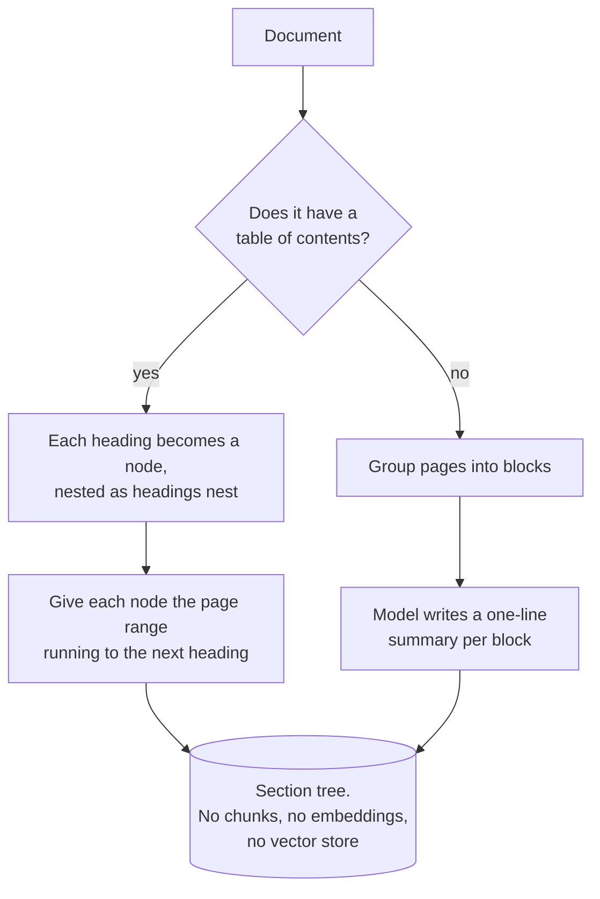
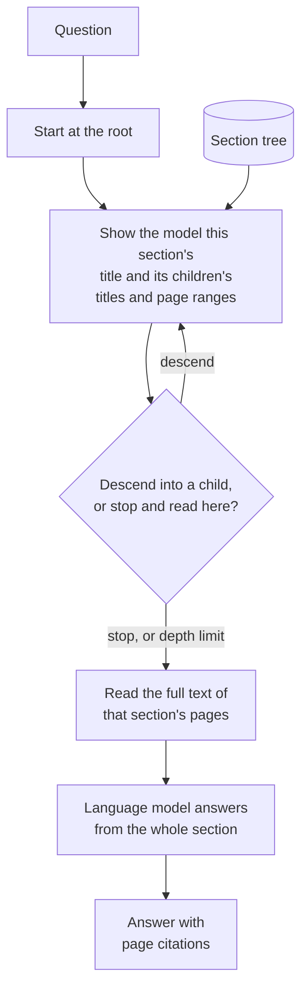

# Vectorless RAG

## What it is

Every other retrieval demo here assumes the same thing: to find something in a document you must first cut it up, convert the pieces to vectors, and compare numbers. Vectorless RAG questions that assumption by asking how a person actually finds something in a long document.

They don't scan every page. They open the table of contents, read the section titles, pick the one that sounds right, and turn to it. If they guessed wrong, they go back and try a neighbour. The document's own structure is the index, and the reasoning is done in natural language.

That is the technique. At ingest, the document's structure is turned into a **tree** — each heading a node, nested as the headings nest, each carrying the page range it covers. No chunking, no embeddings, no vector store. At question time, the model stands at the root, is shown the current section's title and its children's titles and page ranges, and makes one decision: descend into a child, or stop and read here. Repeat until it stops, then load the full text of the chosen section's pages and answer from it.

Two consequences follow, and they are the whole argument for the technique.

**Relevance replaces similarity.** Vector search retrieves what *resembles* the question, which is a proxy for what answers it — usually a good proxy, sometimes a bad one. A model choosing between "Chapter 4: Termination" and "Chapter 5: Renewal" for a question about ending a contract early is reasoning about which section would *contain* the answer, which is the actual question. This is why the approach does disproportionately well on professional documents where the relevant section is often not the one that sounds most like the query.

**The unit of retrieval is a whole section, not a fragment.** Nothing was ever cut, so nothing was cut in the wrong place. A table arrives complete, with its caption and its footnotes. Every failure mode caused by chunk boundaries simply does not exist here.

The costs are equally direct. Navigation is a sequence of model calls before answering even begins, so latency grows with tree depth in a way a vector lookup does not. And the technique inherits the document's structure wholesale: given a good table of contents it is excellent, and given none it has nothing to navigate.

## Ingestion flow

## Retrieval and generation flow

## Strengths

- **It optimises for relevance, not resemblance.** Choosing a section by reasoning about what it would contain beats similarity matching precisely where similarity is a poor proxy.
- **No chunking, so no chunking failures.** Sections arrive whole — tables intact, definitions with their terms, lists unbroken.
- **The trace is readable by anyone.** A path of section titles is an explanation a domain expert can check without knowing what an embedding is.
- **Nothing to build or maintain.** No vector store, no index, no re-embedding when the document changes or the embedding model is upgraded.
- **Cheap to set up for a handful of documents**, where standing up embedding infrastructure would cost more than it returns.
- **Structure is free signal.** A well-organised document already encodes where things live, and most pipelines throw that away at the first chunking step.

## Limitations

- **Latency scales with depth.** Every navigation step is a sequential model call before answering starts, against a single fast lookup for vector search.
- **It commits without backtracking.** The model picks one branch per level; an answer spanning two sibling sections gets only the branch it entered.
- **A bad early choice is unrecoverable.** Choosing wrong at the root means the right section is never reachable, with no mechanism to notice.
- **It is only as good as the document's structure.** Generic headings ("Chapter 1", "Appendix B") give the model nothing to reason about, and a missing table of contents means falling back to summarised page blocks — a coarse, expensive approximation of chunking.
- **Flat trees make hard decisions.** One level with fifty entries turns each step into a wide multiple-choice question, which small models handle poorly.
- **A whole section may not fit.** Reading a long section into the prompt hits the context window and gets truncated, which can cut away the answer.
- **No scores, no ranking.** Retrieval returns one section, so there is no relevance signal to threshold on, sort by, or use to detect a bad retrieval.
- **It does not scale to large corpora.** Navigating one document is natural; navigating ten thousand requires an index — which is what vectors are for.

## Where to use it

- Long, well-structured professional documents where the table of contents is meaningful: specifications, manuals, textbooks, regulatory filings, contracts, annual reports.
- Questions whose relevant section is not the one that sounds most like the question — where similarity search is weakest.
- Anywhere retrieval must be explainable to non-technical reviewers in plain language.
- Small collections, or single-document analysis, where index infrastructure isn't worth standing up.
- Not for large corpora, flat or unstructured documents, latency-sensitive interfaces, or documents whose answers are scattered across many sections rather than concentrated in one.

## In this demo

On ingest, PyMuPDF reads the PDF's table of contents with `get_toc()` and builds a tree — each bookmark a node, nested as the bookmarks nest, with a page range running to the next bookmark — saved as JSON under `data/vectorless/`. With no table of contents, pages are grouped `VECTORLESS_PAGE_GROUP_SIZE` at a time and the fast chat model writes a one-sentence summary per group so there is still something to navigate. At question time the model descends from the root, one `core.llm.complete()` call per step, capped at `VECTORLESS_MAX_DEPTH`; once it stops, that section's pages are read into the prompt (truncated at `VECTORLESS_MAX_READ_CHARS`) and answered with page citations. If the model's response can't be parsed as a valid choice, the code stops and reads the current section rather than guessing. The page shows the exact path taken through the tree and which pages were read. Because nothing is ranked, every page shown carries the same score.

The technique is sometimes called reasoning-based or tree-based retrieval; [PageIndex](https://github.com/VectifyAI/PageIndex) is the best-known implementation of it.
